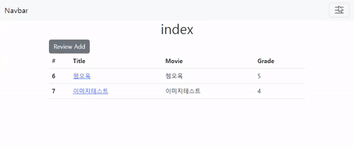

# TIL Project-Template

## INTRO

## 

- 🗓 프로젝트 기간
  - 2022.10.12
  
- 💻 사용 기술
  - Python, Django, HTML, CSS, Bootstrap5
  
- ⭐ 나의 역할
  - 기존 Movie_review pjt , 회원가입, 로그인, 아웃 기능 구현
  
    
  
- 💡 배운 점
  - 로그인에 대한 이해
    - 브라우저와 서버는 `sateless` (무상태) 임, 요청과 응답 이후엔 통신이 끝난 상태이며 주고 받는메시지는 독립적임
    - 그럼에도 로그인 '상태'를 유지할 수 있는 이유는 서버와 클라이언트간 '쿠키와 세션'이 존재하기 때문
    - `Session` : 클라이언트가 서버에 접속하면 특정 session id를 발급, session id 를 쿠키에 저장 후 클라이언트에게 전달, 클라이언트는 다시 동일한 서버에 접속 할 때 보유한 쿠키를 서버에 전달, 서버에서는 쿠키의 session id를 확인해 알맞은 로직을 처리 후 응답함.
  - `django-Login`
    - `AuthenticationForm` : 로그인을 위한 built-in form ( ModelForm이 아닌 일반 Form에 상속)
  - `django-Logout`
    - logout() 함수 사용.
  - `Limiting access to logged-in users` : 로그인 사용자에 대한 접근 제한

## 🚩목적

> project's goal

- 로그인에 대한 브라우저와 서버간의 통신을 이해할 수 있다.
- `django` 로그인과 로그아웃 기능을 구현할 수 있다.


# 🧾기능 소개


# 문제 해결

## 문제 상황


## 해결


```python

```