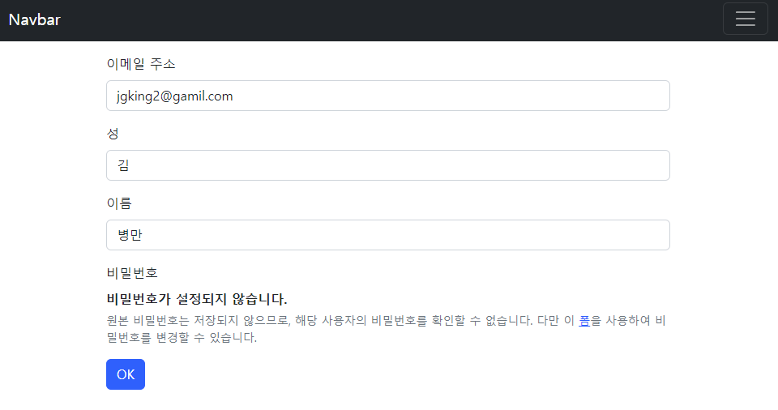

# TIL Project-Template



## INTRO

- 🗓 프로젝트 기간
  - 2022.10.13
- 💻 사용 기술
  - Python, Django, HTML, CSS, Bootstrap5
- ⭐ 나의 역할
  - `user` 업데이트 기능 추가, 기존 패스워드를 제외한 입력사항 수정
  - `form.py` : `UserChangeForm`
- 💡 배운 점
  - 기존의 Articles CRUD 와  User 의 CRUD 의 로직은 비슷하나 인증 이라는 절차와 `password`의 차이로 인한 form의 사용, 메서드들이 다르다.
  - 


## 🚩목적

> project's goal

- 회원가입한 유저의 정보의 수정 기능을 추가.
- 


# 🧾기능 소개

```python
# forms.py
from django.contrib.auth.forms import UserCreationForm, UserChangeForm
from django.contrib.auth import get_user_model

class CustomUserCreationForm(UserCreationForm):
    class Meta:
        model = get_user_model()
        fields = ('username', 'email', 'last_name', 'first_name')

class CustomUserChangeForm(UserChangeForm):
    class Meta:
        model = get_user_model()
        fields = ('email', 'last_name', 'first_name')
        
# Meta 의 model 은 직접 참조 하지않고 함수로 참조해오는것이 관용적.
# UserCreationForm 으로 회원가입 폼, UserChangeForm 으로 정보수정 폼을 상속한다.
# 상속한 폼을 커스텀해서 사용한다.

# views.py
from django.shortcuts import render, redirect
from .forms import CustomUserCreationForm, CustomUserChangeForm
from django.contrib.auth.forms import AuthenticationForm
from django.contrib.auth import login as auth_login
from django.contrib.auth import logout as auth_logout
from django.contrib.auth import get_user_model
from django.contrib.auth.decorators import login_required
# Create your views here.
from django.contrib.auth.decorators import login_required

@login_required
def update(request):
    if request.method == 'POST':
        form = CustomUserChangeForm(request.POST, instance=request.user)
        if form.is_valid():
            form.save()
            return redirect( 'accounts:detail', request.user.pk)
    else:
        form = CustomUserChangeForm(instance=request.user)
    context = {
        'form': form
    }
    return render(request, 'accounts/update.html', context)

# login_required 데코레이터를 사용해서 회원정보 수정은 로그인한 상태에서 가능하도록함.
```

