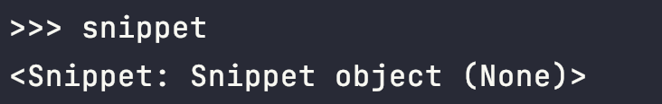
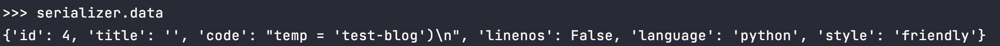
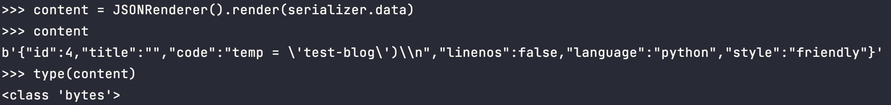
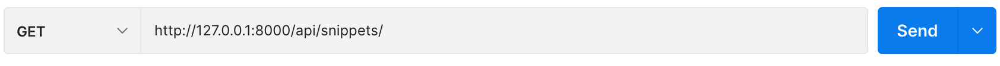
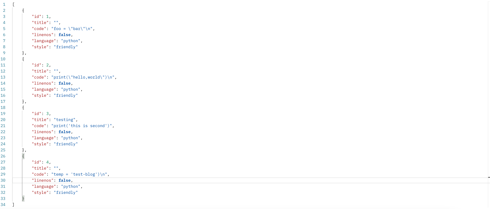
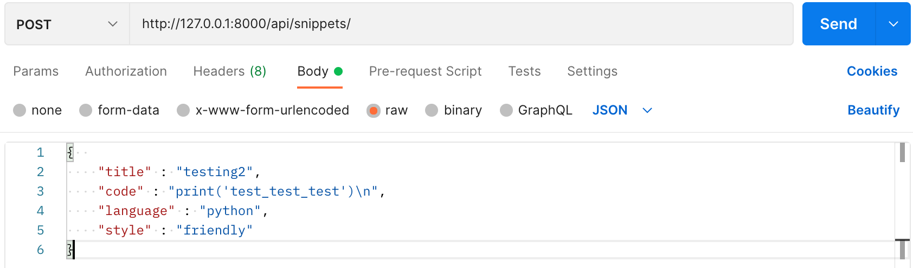
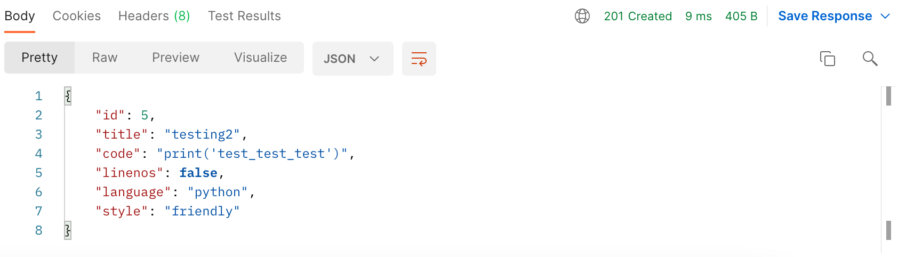

## [# 프로젝트 세팅 & 가상환경 만들기](https://devforyou.tistory.com/27?category=536527#%--%--%ED%--%--%EB%A-%-C%EC%A-%-D%ED%-A%B-%--%EC%--%B-%ED%-C%--%--%--%--%EA%B-%--%EC%--%--%ED%--%--%EA%B-%BD%--%EB%A-%-C%EB%--%A-%EA%B-%B-)

프로젝트를 진행할 폴더를 하나 만들고, 그안에서 가상환경을 만들어 준다.

```shell
python3 -m venv env      --> 가상환경 만들기
source env/bin/activate  --> 가상환경 실행 (env)
```

그러면 env폴더가 만들어진다. source는 가상환경을 실행주는 코드이다. 항상 장고 작업전에 가상환경이 실행 되어 있는지 확인하자.

```bash
pip install django
pip install djangorestframework
pip install pygments  # We'll be using this for the code highlighting
```

장고를 설치해주고, djangorestframework을 설치해주자, pygments는 코드하이러이팅을 해주는데 사용한다고 하는데, 이따 모델을 만들어 줄때 사용하는데, 해당 튜툐리얼을 진행하면서 작성하는 텍스트 문구에 코드를 입력하는거 같다. 그래서 그걸 사용하는데 쓰이는거 같다. 

```bash
python manage.py startapp snippets
```

이제 앱을 하나 만들어주고, 앱을 만들면 항상 settings.py에 추가해줘야 한다. 

```python
INSTALLED_APPS = [
    ...
    'rest_framework',
    'snippets',
]
```

추가해주자.

 

## [# 모델 만들기](https://devforyou.tistory.com/27?category=536527#%--%--%EB%AA%A-%EB%-D%B-%--%EB%A-%-C%EB%--%A-%EA%B-%B-)

공식문서가 안내하기를 Snippet은 우리의 코드를 저장하는 간단한 모델이라고 한다.

DRF를 사용하지 않을때는 url -> models -> views 순으로 나는 만들어 줬다. url분리해주고 쓰일 모델 만들어주고 그 모델을 통해서 원하는 views를 설계했는데, DRF가 추가됨에 따라, url -> models -> serializers -> views를 작성했다. 만든 모델을 serializers에 등록해주는 느낌이고, 튜툐리얼#1 에 등장하지만 모델의 필드를 추가해주는 방법이 두가지가 있었다. 

```python
from django.db import models
from pygments.lexers import get_all_lexers
from pygments.styles import get_all_styles

LEXERS = [item for item in get_all_lexers() if item[1]]
LANGUAGE_CHOICES = sorted([(item[1][0], item[0]) for item in LEXERS])
STYLE_CHOICES = sorted([(item, item) for item in get_all_styles()])


class Snippet(models.Model):
    created = models.DateTimeField(auto_now_add=True)
    title = models.CharField(max_length=100, blank=True, default='')
    code = models.TextField()
    linenos = models.BooleanField(default=False)
    language = models.CharField(choices=LANGUAGE_CHOICES, default='python', max_length=100)
    style = models.CharField(choices=STYLE_CHOICES, default='friendly', max_length=100)

    class Meta:
        ordering = ['created']
```

모델을 정의할때 Meta가 뭘까 계속 궁금했다. Meta는 모델의 정보를 담고있는거라고 생각하면 된다고 했다. 필수는 아니고, 뭐 권한, 데이터베이스 이름, 추상화, 순서지정과 같은걸 할수 있다고 한다.

[ Django 모델의 메타 클래스Django 모델에서 메타 클래스의 역할에 대해 알아보세요.www.delftstack.com](https://www.delftstack.com/ko/howto/django/class-meta-in-django/)

참고하면 좋을거 같다.

```vim
python manage.py makemigrations snippets
python manage.py migrate snippets
```

앱을 등록하면 셋팅에 추가해주는거 처럼, 모델을 만들거나 수정했으면 이를 반영시키기 위해 makemigrateions과 migrate를 해줘야한다.

## [# serializers 만들기](https://devforyou.tistory.com/27?category=536527#%--%--serializers%--%EB%A-%-C%EB%--%A-%EA%B-%B-)

serializers는 Json으로 바꿔주거나, Json을 파이썬의 형식으로 바꿔준다. 아직까지 배우걸로까지는 그렇다. 아까 적었던거처럼 두가지 방법이 있었다. 

### [##방법1](https://devforyou.tistory.com/27?category=536527#%--%--%EB%B-%A-%EB%B-%---)

```routeros
from rest_framework import serializers
from snippets.models import Snippet, LANGUAGE_CHOICES, STYLE_CHOICES


class SnippetSerializer(serializers.Serializer):
    id = serializers.IntegerField(read_only=True)
    title = serializers.CharField(required=False, allow_blank=True, max_length=100)
    code = serializers.CharField(style={'base_template': 'textarea.html'})
    linenos = serializers.BooleanField(required=False)
    language = serializers.ChoiceField(choices=LANGUAGE_CHOICES, default='python')
    style = serializers.ChoiceField(choices=STYLE_CHOICES, default='friendly')

    def create(self, validated_data):
        """
        Create and return a new `Snippet` instance, given the validated data.
        """
        return Snippet.objects.create(**validated_data)

    def update(self, instance, validated_data):
        """
        Update and return an existing `Snippet` instance, given the validated data.
        """
        instance.title = validated_data.get('title', instance.title)
        instance.code = validated_data.get('code', instance.code)
        instance.linenos = validated_data.get('linenos', instance.linenos)
        instance.language = validated_data.get('language', instance.language)
        instance.style = validated_data.get('style', instance.style)
        instance.save()
        return instance
```

고냥 모델을 한번 더 적어주는 느낌이다.

 

### [## 방법2](https://devforyou.tistory.com/27?category=536527#%--%--%--%EB%B-%A-%EB%B-%---)

```kotlin
class SnippetSerializer(serializers.ModelSerializer):
    class Meta:
        model = Snippet
        fields = ['id', 'title', 'code', 'linenos', 'language', 'style']
```

필드에 장고모델에 있는 필드들을 저런식으로 적어주기만 하면 된다. 아주 깔끔하니 편했다.

 

## [# shell을 통해 확인해보기](https://devforyou.tistory.com/27?category=536527#%--%--shell%EC%-D%--%--%ED%--%B-%ED%--%B-%--%ED%--%--%EC%-D%B-%ED%--%B-%EB%B-%B-%EA%B-%B-)

여기서 확인해 볼 것은, Snippet모델을 만들고, serialize해준 후 그 결과가 어떻게 나오는지 비교해보는 것이다.

```bash
python manage.py shell
```

을 입력해 shell을 켜준다.

그리고 공식문서와 같이 Snippet를 만들어 줬다.

```clean
from snippets.models import Snippet
from snippets.serializers import SnippetSerializer
from rest_framework.renderers import JSONRenderer
from rest_framework.parsers import JSONParser

snippet = Snippet(code='foo = "bar"\n')
snippet.save()

snippet = Snippet(code='print("hello, world")\n')
snippet.save()
```

형식은 장고, 저런식으로 만들어만 보자, .save()는 만든걸 DB에 저장시켜 준다. 저거 안하면 만들어놓고 저 변수를 잃게되면 그냥 없어진다.

만든 snippet를 출력해보자.





이제 이걸 직렬화 해주고, 살펴보자 진짜 신기하게도 알아서 이쁘게 딱 만들어 놓는다.

```bash
serializer = SnippetSerializer(snippet)
serializer.data
```


난 이미 몇개 만들어봐서 id가 4이다.


 

이건 JSON데이터를 파이썬에 맞게 변형해준다. 이게 시리얼라이즈(직렬화)의 장점이 아닐까 싶다. 이런 유연한 변동..

```bash
JSONRenderer().render( '여기에 JSON데이터를 넣자' )
content = JSONRenderer().render(serializer.data)
content
```

그래서 이렇게 만들고 한번 타입을 확인해 봤더니 bytes였다. 저번 리액트랑 연동할때 저 bytes형씩인게 아주 내 발목을 잡았는데, 파이썬 기본 타입이라니 .. ㅎㅎ





이제 뷰를 만들고, POSTMAN을 통해 왔다리 갔다리 해보자.

아 저기 시리얼라이즈 할때

```reasonml
SnippetSerializer(snippets, many=True)
```

many에 True값을 옵션으로 주면, objects.all()이렇게 받아온 여러개 쿼리를 한번에 바꿔줄 수도 있다.

 

## [# View작성하기](https://devforyou.tistory.com/27?category=536527#%--%--View%EC%-E%--%EC%--%B-%ED%--%--%EA%B-%B-)

```python
from django.http import HttpResponse, JsonResponse
from django.views.decorators.csrf import csrf_exempt
from rest_framework.parsers import JSONParser
from snippets.models import Snippet
from snippets.serializers import SnippetSerializer

@csrf_exempt
def snippet_list(request):
    """
    List all code snippets, or create a new snippet.
    """
    if request.method == 'GET':
        snippets = Snippet.objects.all()
        serializer = SnippetSerializer(snippets, many=True)
        return JsonResponse(serializer.data, safe=False)

    elif request.method == 'POST':
        data = JSONParser().parse(request)
        serializer = SnippetSerializer(data=data)
        if serializer.is_valid():
            serializer.save()
            return JsonResponse(serializer.data, status=201)
        return JsonResponse(serializer.errors, status=400)
        
        
@csrf_exempt
def snippet_detail(request, pk):
    """
    Retrieve, update or delete a code snippet.
    """
    try:
        snippet = Snippet.objects.get(pk=pk)
    except Snippet.DoesNotExist:
        return HttpResponse(status=404)

    if request.method == 'GET':
        serializer = SnippetSerializer(snippet)
        return JsonResponse(serializer.data)

    elif request.method == 'PUT':
        data = JSONParser().parse(request)
        serializer = SnippetSerializer(snippet, data=data)
        if serializer.is_valid():
            serializer.save()
            return JsonResponse(serializer.data)
        return JsonResponse(serializer.errors, status=400)

    elif request.method == 'DELETE':
        snippet.delete()
        return HttpResponse(status=204)
```

 

## [# POST맨으로 확인해보기](https://devforyou.tistory.com/27?category=536527#%--%--POST%EB%A-%A-%EC%-C%BC%EB%A-%-C%--%ED%--%--%EC%-D%B-%ED%--%B-%EB%B-%B-%EA%B-%B-)

그리고 urls.py를 입맛에 맞게 바꿔준 후 포스트맨 실행해보자!

그리고 snippets view에 GET요청과 POST요청을 날려보겠다.

\##POST







JSON타입으로 이쁘게 정리해서 보내준다. 벌써부터 편하다..

 

\##GET







 

아주 잘온다.

------

튜툐리얼#1 에서 기억해야할건, 시리얼라이즈를 만들어 준 후, view에서 이것을 사용할때가 중요한데, 시리얼라이즈를 하고 이것은 JsonResponse로 보내면 된다는 것이다.