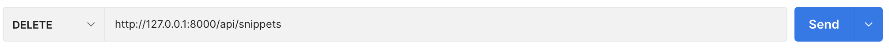

## [# requset.POST & request.data](https://devforyou.tistory.com/28?category=536527#%--%--requset-POST%--%--%--request-data)

```bash
request.POST  # Only handles form data.  Only works for 'POST' method.
request.data  # Handles arbitrary data.  Works for 'POST', 'PUT' and 'PATCH' methods.
```

\- requset.POST는 form에서 보낸 데이터를 다룬다고 한다. 그에 반해 - request.data는 임의의 데이터를 다룰 수 있다고 한다. 사실 정확하게 이해가 가지는 않았다. 그래서 일단 POST맨으로 GET요청과 POST요청을 보내봤다. form데이터는 내가 아는 html에서의 폼인거 같다.

### [## GET](https://devforyou.tistory.com/28?category=536527#%--%--%--GET)

튜토리얼#1에서 만들었던 snippet_list에 GET을 줘봤다. 


*request 오타


일단 POST가 아니기 때문에 담겨오는 값이 없어서, 안에 아무것도 안뜬다. 근데 타입이 딱봐도 다르다. 그래서 타입을 한번 살펴봤다.


*request 오타


request.POST 는 QueryDict으로 값을 받아온다. 일단 이렇게 오면 한번더 가공을 해줘야했다. 그러나 request.data는 그냥 dict형태로 온다. 파이썬에서 그리고 장고에서 이렇게 값이 넘어오면 아주 땡큐였다. 지금까지 내가 경험해본 봐로는 말이다.

장고 공식문서의 request에 대한 설명을 참고하자. request.POST는 request.body와 유의해서 사용하라고하는데. 데이터에만 액세스할 경우 request.POST를 추천한다고 한다.

[ Request and response objects | Django documentation | DjangoDjango The web framework for perfectionists with deadlines. Overview Download Documentation News Community Code Issues About ♥ Donatedocs.djangoproject.com](https://docs.djangoproject.com/en/4.0/ref/request-response/)

 

### [## POST](https://devforyou.tistory.com/28?category=536527#%--%--%--POST)

#### [### raw-JSON](https://devforyou.tistory.com/28?category=536527#%--%--%--%--raw-JSON)

이번에는 포스트를 날려본다! 일단 raw-JSON으로 날려보았다.


완전 띠용이다. request.POST에 당연히 쿼리형식으로 같은 데이터가 들어올 것 이라고 예상했지만, 아무것도 없다.. 아까 DRF공식문서에서는 오로지 form-data만을 다룬다고 했다. 그냥 raw-JSON으로 보냈기 때문에 값을 받아오지 못하는거 같았다. 그렇다면 form으로도 한번 쏴보자

#### [### form-data](https://devforyou.tistory.com/28?category=536527#%--%--%--%--form-data)

일단 이 form-data는 html에서 <form></form>태그로 쏴주는거 같다. key와 value로 묶어서 보내진다.


완전 홀리쉣이다. 난 JSON에서와 같이 dict으로 올줄 알았는데 query로 와버린다.. 혹시 몰라서 타입도 찍어봤다.


변함은 없었다. 그래서 일단 request.data 쓰는게 더 범용성도 좋을거 같다는 결론이다. form으로 쏠때는 항상 잘 확인해야할거 같다. 근데 리액트에서 JSON으로 어차피 쏴지니까 req.data로 쓰는게 맞는거 같다.

```python
request.data.get("데이터이름")
```

으로 form-data를 받을 일이 있으면 받으면 될거 같다.

## [# Django-rest-framework 의 Response](https://devforyou.tistory.com/28?category=536527#%--%--Django-rest-framework%--%EC%-D%--%--Response)

순수 장고에서는 response를 세분화 시켰다. Http이면 HttpResponse, Json이면 JsonResponse 등등 구분화 시켰는데 

```angelscript
from rest_framework.response import Response
return Response(data)  # Renders to content type as requested by the client.
```

을 통해 Response를 불러 온 후 사용한다. 대소문자 유의해서 사용해야한다. 공식문서에 따르면 알아서 뭐 보내줄지 결정해서 보내준다 그런 뜻인거 같다

[ Responses - Django REST frameworkresponse.py Unlike basic HttpResponse objects, TemplateResponse objects retain the details of the context that was provided by the view to compute the response. The final output of the response is not computed until it is needed, later in the response procwww.django-rest-framework.org](https://www.django-rest-framework.org/api-guide/responses/)

일단 쓰라는거 써야겠다. 밑에서 보면 이걸로 JsonResponse대신 Response를 써서 코드를 간결화 시킨다.

## [# Status Code 상태코드](https://devforyou.tistory.com/28?category=536527#%--%--Status%--Code%--%EC%--%--%ED%--%-C%EC%BD%--%EB%--%-C)

튜토리얼#1에서는 

```python
JsonReponse(data,status=200)
```

이런식으로 status를 표현해줬는데 공식문서가 말하기를 이게 좀 부정확하다고 한다. 그래서 

```python
from rest_framework import status

return Response(serializer.errors, status=status.HTTP_400_BAD_REQUEST)
```

 

이런식으로 더 자세한 status를 제공해준다고 한다.

## [# API views 감싸기](https://devforyou.tistory.com/28?category=536527#%--%--API%--views%--%EA%B-%--%EC%-B%B-%EA%B-%B-)

\- 함수형에서는 @api_view 데코레이터로 사용하고

\- 클래스형에서는 APIView 라고하는데 튜토리얼3에 등장할거 같다 그때 확실하게 다시 정리해보자

 

## [# 튜툐리얼#1 코드 개선](https://devforyou.tistory.com/28?category=536527#%--%--%ED%-A%-C%ED%--%--%EB%A-%AC%EC%--%BC%---%--%EC%BD%--%EB%--%-C%--%EA%B-%-C%EC%--%A-)

```python
from rest_framework import status
from rest_framework.decorators import api_view
from rest_framework.response import Response
from snippets.models import Snippet
from snippets.serializers import SnippetSerializer


@api_view(['GET', 'POST'])
def snippet_list(request):
    """
    List all code snippets, or create a new snippet.
    """
    if request.method == 'GET':
        snippets = Snippet.objects.all()
        serializer = SnippetSerializer(snippets, many=True)
        return Response(serializer.data)

    elif request.method == 'POST':
        serializer = SnippetSerializer(data=request.data)
        if serializer.is_valid():
            serializer.save()
            return Response(serializer.data, status=status.HTTP_201_CREATED)
        return Response(serializer.errors, status=status.HTTP_400_BAD_REQUEST)
```

이제 전 코드를 개선시켰다. 바뀐점과 추가된 점을 찾아보면

### [## api_view 데코레이터를 추가하여 GET과 POST요청만 담당할 수 있게 함.](https://devforyou.tistory.com/28?category=536527#%--%--%--api-view%--%EB%-D%B-%EC%BD%--%EB%A-%--%EC%-D%B-%ED%--%B-%EB%A-%BC%--%EC%B-%--%EA%B-%--%ED%--%--%EC%--%AC%--GET%EA%B-%BC%--POST%EC%-A%--%EC%B-%AD%EB%A-%-C%--%EB%-B%B-%EB%-B%B-%ED%--%A-%--%EC%--%--%--%EC%-E%--%EA%B-%-C%--%ED%--%A--)

궁금해서 다른거 쏘면 어떻게 되는지 쏴봤다.





405 에러를 반환시켜준다. 

 

### [## JsonResponse에서 Response로 바뀜](https://devforyou.tistory.com/28?category=536527#%--%--%--JsonResponse%EC%--%--%EC%--%-C%--Response%EB%A-%-C%--%EB%B-%--%EB%--%-C)

```python
return Response(serializer.data)
```

이렇게 바꼇다. 이건 딱히 설명 할거 없을거 같다.

 

### [## requset.data 사용](https://devforyou.tistory.com/28?category=536527#%--%--%--requset-data%--%EC%--%AC%EC%-A%A-)

```python
# 기존코드
elif request.method == 'POST':
    data = JSONParser().parse(request) #JSONParser 의 parser() 메서드를 이용하여 딕셔너리 형태로 변환한다.
    serializer = SnippetSerializer(data=data)
    if serializer.is_valid():
        serializer.save()
        return JsonResponse(serializer.data, status=201)
    return JsonResponse(serializer.errors, status=400)
    
# 바뀐코드
elif request.method == 'POST':
        serializer = SnippetSerializer(data=request.data)
        if serializer.is_valid():
            serializer.save()
            return Response(serializer.data, status=status.HTTP_201_CREATED)
        return Response(serializer.errors, status=status.HTTP_400_BAD_REQUEST)
        
        
# Snippet DB 인스턴스 시리얼라이즈 과정 2 (Python Dictionary -> JSON 데이터)
content = JSONRenderer().render(serializer.data)


# JSON 데이터 디시리얼라이즈 과정 1 (JSON 데이터 -> Python Dictionary)
stream = io.BytesIO(content)
data = JSONParser().parse(stream)

# JSON 데이터 디시얼라이즈 과정 2 (Python Dictionary -> DB 인스턴스)
serializer = SnippetSerializer(data=data)
serializer.is_valid()
# True
serializer.validated_data
# OrderedDict([('title', ''), ('code', 'print("hello, world")\n'), ('linenos', False), ('language', 'python'), ('style', 'friendly')])
serializer.save()
# <Snippet: Snippet object>
```

request.data로 값을 한번에 가져와버렸다. 그전에는 JSONParser().parse()의 과정을 거쳤었다.


***

save는 instance가 존재하면 update, 아니면 create를 해준다

```python
# .save() will create a new instance.
serializer = MySerializer(data=data)

# .save() will update the existing `comment` instance.
serializer = MySerializer(comment, data=data)
```

***

 

\## status.HTTP_***_**** 사용

이건 위에서 설명했기때문에 생략하겠다.

## [# snippet_detail](https://devforyou.tistory.com/28?category=536527#%--%--snippet-detail)

```python
@api_view(['GET', 'PUT', 'DELETE'])
def snippet_detail(request, pk):
    """
    Retrieve, update or delete a code snippet.
    """
    try:
        snippet = Snippet.objects.get(pk=pk)
    except Snippet.DoesNotExist:
        return Response(status=status.HTTP_404_NOT_FOUND)

    if request.method == 'GET':
        serializer = SnippetSerializer(snippet)
        return Response(serializer.data)

    elif request.method == 'PUT':
        serializer = SnippetSerializer(snippet, data=request.data)
        if serializer.is_valid():
            serializer.save()
            return Response(serializer.data)
        return Response(serializer.errors, status=status.HTTP_400_BAD_REQUEST)

    elif request.method == 'DELETE':
        snippet.delete()
        return Response(status=status.HTTP_204_NO_CONTENT)
```

 

## [# add suffixes to urls](https://devforyou.tistory.com/28?category=536527#%--%--add%--suffixes%--to%--urls)

뭔지는 모르겠는데 하라는대로 하고 주소 맨 끝에 .api .json으로 하면 응답으로 보여지는게 달라진다..

```ruby
def snippet_list(request, format=None):
def snippet_detail(request, pk, format=None):
from django.urls import path
from rest_framework.urlpatterns import format_suffix_patterns
from snippets import views

urlpatterns = [
    path('snippets/', views.snippet_list),
    path('snippets/<int:pk>', views.snippet_detail),
]

urlpatterns = format_suffix_patterns(urlpatterns)
```

 

### [## http://localhost:8000/api/snippets.json](https://devforyou.tistory.com/28?category=536527#%--%--%--http%-A%-F%-Flocalhost%-A----%-Fapi%-Fsnippets-json)


 

### [## http://localhost:8000/api/snippets.api](https://devforyou.tistory.com/28?category=536527#%--%--%--http%-A%-F%-Flocalhost%-A----%-Fapi%-Fsnippets-api)


