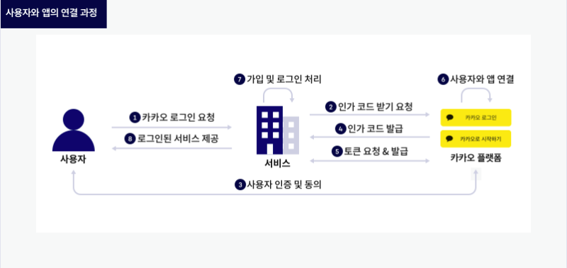

# 카카오 메시지 나에게 보내기



### 인증토큰

- api 키와 redirect_uri를 get요청에 담아 인증코드를 요청한다.
- 카카오로 로그인시, 인증코드를 받고 인증코드와 api 키를 이용해 토큰을 발급받는다.
- 토큰을 json형태로 저장 혹은 DB에 저장하는 과정을 거친다.

```python
import json
import requests

"https://kauth.kakao.com/oauth/authorize?client_id={rest_api}&redirect_uri={redirect_uri}&response_type=code"

url = 'https://kauth.kakao.com/oauth/token'
rest_api_key = '{rest_api_key}'
redirect_uri = 'https://example.com/oauth'
authorize_code = 'qS1IS4ZIH6GwoQN4rR7d3H4WofRm8Aeh14xIvy1vJGoyWdPrMi9BGLn2v1ZJ5Ie6sGJcZQo9dJcAAAGEYokpkg'

data = {
  'grant_type':'authorization_code',
  'client_id':rest_api_key,
  'redirect_uri':redirect_uri,
  'code': authorize_code,
  }

response = requests.post(url, data=data)
tokens = response.json()
print(tokens)

\# json 저장
with open("kakao_code.json","w") as fp:
  json.dump(tokens, fp)
```

### 메시지 보내기 (나에게)

- 유효한 토큰으로 메시지를 text에 담아 보낸다 최대 200자

```python
import json
import requests

with open("kakao_code.json","r") as fp:
    tokens = json.load(fp)

url="https://kapi.kakao.com/v2/api/talk/memo/default/send"
# kapi.kakao.com/v2/api/talk/memo/default/send 
headers={
    "Authorization" : "Bearer " + tokens["access_token"]
}
data={
    "template_object": json.dumps({
        "object_type":"text",
        "text":"요원이 거의 모였어요 준비하세요!",
        "link":{
            "web_url":"www.naver.com",
            "mobile_url":"www.naver.com"
        }
    })
}

response = requests.post(url, headers=headers, data=data)
response.status_code

print(response.status_code)
if response.json().get('result_code') == 0:
	print('메시지를 성공적으로 보냈습니다.')
else:
	print('메시지를 성공적으로 보내지 못했습니다. 오류메시지 : ' + str(response.json()))
```

