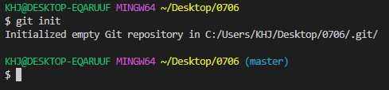
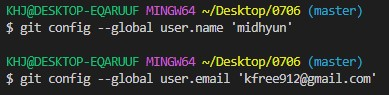
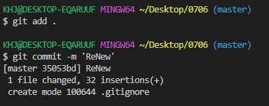
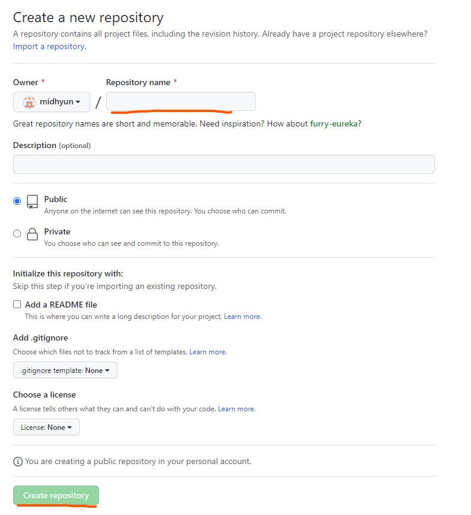
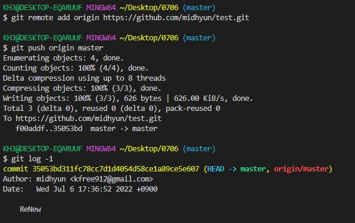

# Git_Hub

> Git_분산버전관리시스템

### Basic language

- git init : .git 폴더 생성 (master)
- git add <*> : staging area
- git commit -m 'msg' : Commit record
- git status
- git log (-1, --oneline)
- git remote add <원격저장소이름> <git url>
  - ex) git remote add origin https://github.com/midhyun/test.git
- git push <원격저장소이름> <브렌치이름>
- git remote -v  : 원격저장소이름, url
- git pull <원격저장소이름> <브렌치이름>

### git init

> $git init 선언 / .git 폴더 생성과 함께 버전관리

### git config

> 사용자 정보 (commit author)를 설정

### git add / git commit

### Git Hub 원격 저장소 만들기

1. 우측 상단 New repository 클릭
2.  Name 적어주고 Create 

### git push origin master

>  git push <원격저장소 이름> <브랜치 이름>

git hub repositories 주소를 origin에 할당한 후 push 명령어를 사용해 원격 저장소로 보낸다.

### Push fail 

- 로컬과 원격 저장소의 커밋 이력이 다른 경우 발생.
  - ★ 작업 전에 Pull 작업 후에 commit, push

----

원칙 1. *로컬에서만 편집* (수정, 삭제, 생성)

> 혼자 작업할 때 볼일 없음.

원칙2. 작업 전에 $ git pull origin matser 

----

 

### .gitignore

- touch .gitignore : git 버전 관리를 무시함.
- .gitignore
- http://gitignore.io 
