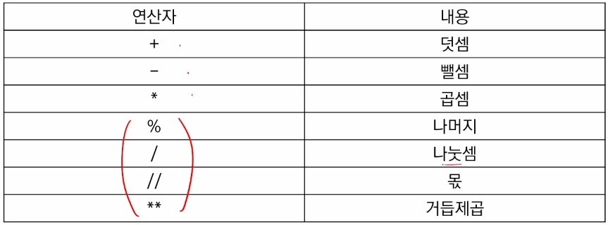

# 0711

> 🌈AM

### Python 기초

- 왜?, 개념, 구조화
  - 토끼굴 같은 곳으로 빠지는 경우가 많음
  - 머릿속에 개념을 확실하게 잡고 가야 흔들리지 않음.

- 컴퓨터(Computer) 프로그래밍 언어 중 하나 
  - 컴퓨터 : 계산기
  - 프로그래밍 : 명령어의 집합.
  - 언어 : 자신의 생각을 나타내고 전달하기 위해 사용하는 체계, 문법적으로 맞는 말의 집합
  - 선언적 지식 (사실에 대한 내용)  vs 명령적 지식 (How-to)

- Python 이란?

  - Easy to learn

    - 다른 프로그래밍 언어보다 문법이 간단하면서도 엄격하지 않음

      ex) 변수에 별도의 타입 지정이 필요 없음 = 동적 타이밍 언어

    - 문법 표현이 매우 간결하여 프로그래밍 경험이 없어도 짧은 시간 내에 마스터 할 수 있음

  - Interpreter 언어 

  - **객체 지향 프로그래밍** 

    - 객체(object) : 숫자, 문자, 클래스 등 **값을 가지고 있는 모든 것** / 

### 파이썬 기초 문법

- **코드 스타일 가이드**
  - 코드를 '어떻게 작성할지'에 대한 가이드라인 / {PEP8}
  - 일관성 있게, 가독성 좋게 작성하자
- 들여쓰기(Identation)
  - Space Sensitive
    - 문장을 구분할 때, 들여쓰기를 사용,
    - space 4칸 혹은 tap 1칸을 입력

- 변수(Variable) 
  - 변하는 값들을 참조 하기 위한 주소가 할당된 값.
  - 변수 할당 연산자(=)를 통해 값을 할당(assignment)
  - 대소문자를 구분하는 알파벳,숫자,특문 가능. 숫자로 시작 x
  - 변수로 사용할 수 없는 예약어, 내장함수, 모듈이름

- 자료형 분류

  - 불린 형 (Boolean Type) : 1 Ture / 0 False
    - bool() == False , bool(1) == True
  - 논리 연산자(Logical Operator)
    - and, or, Not 
  - 수치형 
    - 모든 정수의 타입은 int
    - 매우 큰 수를 나타낼 때 오버플로우가 발생하지 않음
    - 실수(Float) 정수가 아닌 모든 실수는 float 타입
    - 

  - 문자열(String Type)

    - 모든 문자는 str 타입, '' or ""

    - 문자열 안에 변수 넣기

      ```python
      score = 100
      print('내 점수는 ' + score + '이야.')
      $ error 
      
      print(f'내 점수는 {score}이야.')
      pi = 3.14
      r = 2
      print(f'원주율은 {pi}고, 원 넓이는 {pi*2*2}')
      # f 스트링을 사용하자 !
      
      # %-formatting < 다른 언어에서도 사용하는 방법 >
      
      
      ```

      

  - 컨테이너 (Container)

    - 시퀀스 (순서가있음), 컬렉션(순서가 없음)

    - ```python
      # 리스트, [ 값 ] 대괄호
      students = ['동현', '효근', '수경', '나영', '다겸', '예지']
      
      # 딕셔너리, { 키 : 값 } 중괄호
      students = {'1회차':['동현','효근'],
                  '2회차':['수경','나영'],
                  '3회차':['다겸','예지']
                 }
      ```

    - 리스트(List) 정의

      - .
      - 값 추가 .append()
      - 값 삭제 .pop()

    - 튜플(Tuple) 정의

      - 불변한 값들의 나열, 순서를 가지며 서로 다른 타입의 요소가 가능함

    - 레인지(Range)

      - 숫자의 시퀀스를 나타내기 위해 사용

        `range(3) = [0, 1, 2] `, `range(1,4) = [1, 2, 3]`,`range(1,5,2) = [1, 3]`

      - ```python
        numbers = range(5)
        print(numbers)
        >>>range(0,5)
        # 리스트로 변환해서 출력하면,
        print(list(numbers))
        >>>[0, 1, 2, 3, 4]
        ```

    - 세트(Set)

      - 순서가 없고 중복된 값이 없음
        - 수학에서의 집합과 동일한 구조를 가지며, 집합 연산도 가능
      - 변경 가능하며(mutable), 반복 가능함(iterable)
        - 단, 셋은 순서가 없어 반복의 결과가 정의한 순서와 다를 수 있음
      - 중괄호{}, 혹은 set()을 통해 생성
        - 빈 Set을 만들기 위해서는 set()을 반드시 활용해야함
      - 순서가 없어 별도의 값에 접근할 수 없음

    - 딕셔너리(Dictionary)

      - 키 - 값 쌍으로 이뤄진 모음 (key - value)

        

> 🌈PM

### 실습

### 알고리즘 문제풀이 사이트

- 코드업
  - 100제 check_up
- 백준
- 프로그래머스
- SWEA
- 해커랭크


