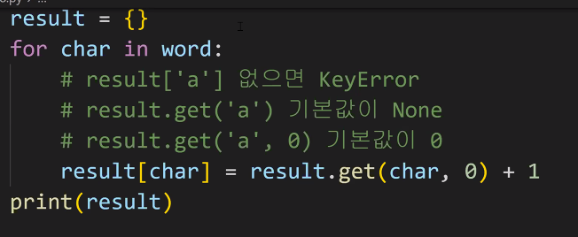

# 0714 

> 🌈AM

### 데이터 타입

- 문자열, 숫자, 리스트, ...
  - type() 으로 확인 가능하지만 타입을 신경써서 구분하는 것 중요함.
- 타입.메서드() 
  - 시퀀스 ( 문자열, 리스트 ) , 컬렉션 ( 세트 , 딕셔너리 )

 ### 시퀀스

- **문자열**

  | 문자열 탐색/검증                | 설명                                                         |
  | ------------------------------- | ------------------------------------------------------------ |
  | `s.find(x)`                     | x의 첫 번째 위치를 **반환**. 없으면, **-1을 반환**           |
  | `s.index(x)`                    | x의 첫 번째 위치를 **반환**. 없으면, **오류 발생**           |
  | `s.isalpha()`                   | 알파벳 문자 여부<br />*단순 알파벳이 아닌 유니코드 상 Letter (한국어도 포함) |
  | `s.isupper()`                   | 대문자 여부                                                  |
  | `s.islower()`                   | 소문자 여부                                                  |
  | `s.istitle()`                   | 타이틀 형식 여부                                             |
  | **문자열 변경**                 |                                                              |
  | `s.replace(old, new[,count])`   | 바꿀 대상 글자를 새로운 글자로 바꿔서 반환.                  |
  | `s.strip([chars])`              | 공백이나 특정 문자를 제거                                    |
  | `s.split(sep=None, axsplit=-1)` | 공백이나 특정 문자를 기준으로 분리 **리스트로 반환**         |
  | `'seperator'.join([iterable])`  | 구분자로 iterable 을 합침                                    |
  | `s.captalize()`                 | 가장 첫 번째 글자를 대문자로 변경                            |
  | `s.title()`                     | ' 나 공백 이후를 대문자로 변경                               |
  | `s.upper()`                     | 모두 대문자로 변경                                           |
  | `s.lower()`                     | 모두 소문자로 변경                                           |
  | `s.swapcase()`                  | 대, 소문자 서로 변경                                         |

- **리스트**

  - 리스트 정의
    - 변경 가능한 값들로 나열된 자료형
    - 순서를 가지며, 서로 다른 타입의 요소를 가질 수 있음
    - **<변경 가능하며(mutable), 반복 가능함(iterable)>** 
    - 항상 대괄호 형태로 정의하며, 요소는 콤마로 구분

  | 문법                     | 설명                                                         |
  | ------------------------ | ------------------------------------------------------------ |
  | `L.append(x)`            | 리스트 마지막에 항복 x를 추가                                |
  | `L.insert(i,x)`          | 리스트 인덱스 i에 항목 x를 삽입                              |
  | `L.remove(x)`            | 리스트 가장 왼쪽에 있는 항목(첫 번째) x를 제거<br />항목이 존재하지 않을 경우, ValueError |
  | `L.pop()`                | 리스트 가장 오른쪽에 있는 항목(마지막)을 반환 후 제거        |
  | `L.extend(m)`            | 순회형 m의 모든 항목들의 리스트 끝에 추가 (+=와 같은 기능)   |
  | `L.index(x, start, end)` | 리스트에 있는 항목 중 가장 왼쪽에 있는 항목 x 의 인덱스를 반환 |
  | `L.reverse()`            | 리스트를 거꾸로 정렬                                         |
  | `L.sort()`               | 리스트를 정렬                                                |
  | `L.count(x)`             | 리스트에서 항목 x가 몇 개 종재하는지 갯수를 반환             |


### 시퀀스

- **세트**

  - 정의
    - 유일한 값들의 모음(collection)
    - 순서가 없고 중복된 값이 없음.
      - 수학에서의 집합과 동일한 구조를 가지며, 집합 연산도 가능
    - 변경 가능하며(mutable), 반복 가능함(iterable)
      - 단, 세트는 순서가 없어 반복의 결과가 정의한 순서와 다를 수 있음.

  > 실습 18번에서 세트를 사용했는데 결과의 순서가 계속 바뀌어서 다른 방법을 강구함.

  | 문법               | 설명                                                         |
  | ------------------ | ------------------------------------------------------------ |
  | `s.copy()`         | 세트의 얕은 복사본을 반환                                    |
  | `s.add(x)`         | 항목 x가 세트 s에 없다면 추가                                |
  | `s.pop()`          | 세트s에서 랜덤하게 항목을 반환하고, 해당 항목을 제거 세트가 비어 있을 경우, KeyError |
  | `s.remove(x) `     | 항목 x를 세트 s에서 삭제 항목이 존재하지 않을 경우, KeyError |
  | `s.discard(x)`     | 항목 x가 세트 s에 있는 경우, 항목 x를 세트s에서 삭제         |
  | `s.update(t)`      | 세트 t에 있는 모든 항목 중 세트 s에 없는 항목을 추가         |
  | `s.clear()`        | 모든 항목을 제거                                             |
  | `s.isdisjoint(t)`  | 세트 s가 세트 t의 서로 같은 항목을 하나라도 갖고 있지 않은 경우, True반환 |
  | `s.issubset(t)`    | 세트 s가 세트 t의 하위 세트인 경우, True반환                 |
  | `s.issuperset(t) ` | 세트 s가 세트 t의 상위 세트인 경우, True반환                 |

- 딕셔너리
  - 정의
    - 키 - 값  쌍으로 이뤄진 모음(collection)
      - 키 ) 불변 자료형만 가능 (리스트, 딕셔너리 등은 불가능함)
      - 값 ) 어떠한 형태든 관계 없음
    - 키와 값은 : 로 구분, 개별 요소는 , 로 구분
    - 변경 가능하며 (mutable), 반복 가능함(iterable)
      - 딕셔너리는 반복문에서 키가 반환됩니다.

| 문법                | 설명                                                         |
| ------------------- | ------------------------------------------------------------ |
| `d.clear()`         | 모든 항목을 제거                                             |
| `d.keys()`          | 딕셔너리 d의 모든 키를 담은 뷰를 반환                        |
| `d.values()`        | 딕셔너리 d의 모든 키를 담은 뷰를 반환                        |
| `d.items()`         | 딕셔너리 d의 모든 키-값의 쌍을 담은 뷰를 반환                |
| `d.get(k)`          | 키 k의 **값을 반환**하는데, 키 k가 딕셔너리 d에 **없을 경우 None을 반환** |
| `d.get(k, v)`       | 키 k의 **값을 반환**하는데, 키 k가 딕셔너리 d에 **없을 경우 v을 딕셔너리에 추가** |
| `d.pop(k)`          | 키 k의 **값을 반환**하고 키 k인 항목을 딕셔너리 d에서 **삭제**하는데, <br />키k가 딕셔너리 d에 **없을 경우 KeyError를 발생** |
| `d.pop(k, v)`       | 키 k의 값을 반환하고 키 k인 항목을 딕셔너리 d에서 **삭제**하는데,<br />키 k가 딕셔너리 d에 **없을 경우 v를 반환** |
| `d.update([other])` | 딕셔너리 d의 값을 매핑하여 업데이트 (덮어쓰기)               |


- **리스트.메서드()**

  - `list.sort()` >>> 리스트 메서드를 활용하면, **원본을 정렬함**. return되는 것은 None

  - `sorted(list)` >>> 함수를 활용하면, **원본을 변경하지 않음** return되는 것은 정렬된 리스트

    ```python
    a = [10, 1, 100]
    a.sort() # a 리스트가 정렬됨 !
    print(a) # [1, 10, 100]
    print(a.sort()) # None # 메서드는 None을 return 함
    
    a= [10, 1, 100]
    print(sorted(a)) # [1, 10, 100] # a값은 변하지 않음.
    print(a) # [10, 1, 100] 
    ```

- 실습 18 번

  