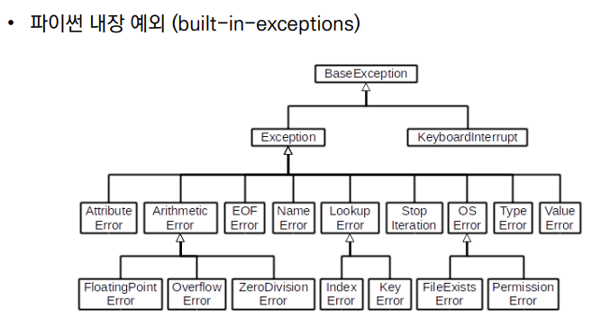

# 0718

> 🌈AM

```python
# 데이터를 기록 {딕셔너리}
result = {}
for i in keys:
    result{i} = result.get{i,0} +1
# 기존 키가 없으면, 1로 초기화를 하고
# 키가 있으면, 기존 값에 더하자.

```


### 1. 디버깅 / 예외처리

- 디버깅
  - branches : 모든 조건이 원하는 대로 동작하는지
  - for loops : 반복문에 진입하는지, 원하는 횟수만큼 실행되는지
  - while loops : for loops와 동일, 종료조건이 제대로 동작하는지
  - function : 함수 호출 시 , 함수 파라미터, 함수 결과

> *"코드의 상태를 신중하게 출력해가며 심사숙고하는 것보다 효과적인 디버깅 도구는 없습니다."* 
>
> *-브라이언 커니헨*	


- 에러와 예외
  - 문법 에러 (Syntax Error) : 발생하면, 파이썬 프로그램은 실행이 되지 않음
  - 파일이름, 줄번호, ^문자를 통해 파이썬이 코드를 읽어 나갈 때 (parser) 문제 가 발생한 위치를 표현
  - 줄에서 에러가 감지된 가장 앞의 우치를 가리키는 캐럿(caret)기호(^)를 표시
  - ex) EOL(End of Line), EOF(End of File)
  
- 예외 처리

  

  - try문 : 오류가 발생할 가능성이 있는 코드를 실행, 예외가 발생되지 않으면, except 없이 실행 종료
  - except문 : 예외가 발생하면 except 절이 실행, 예외 상황을 처리하는 코드를 받아서 실행
  - raise : 에러 발생시키기 