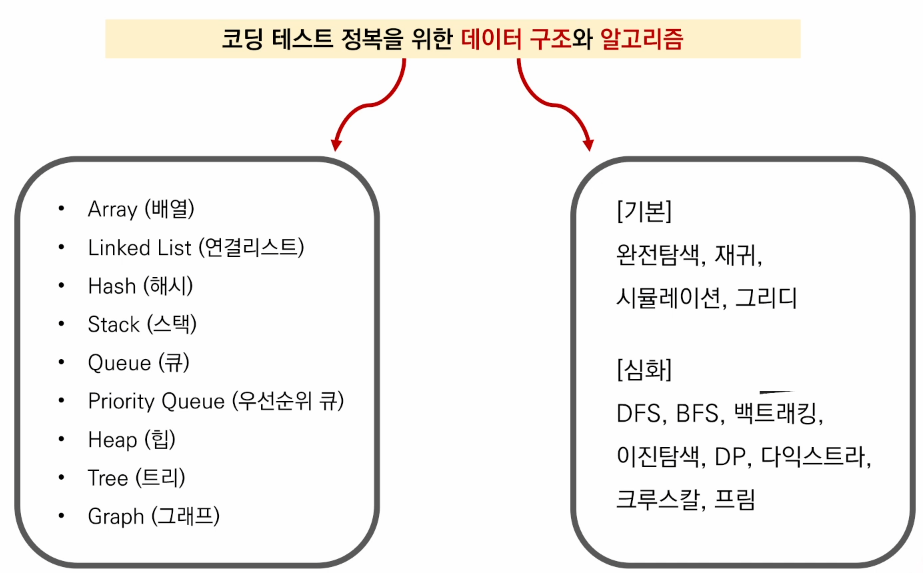

# 0725

### 코딩 테스트 종류

- 온라인 : 보통 1 차의 기본역량테스트, 
  - 사전에 연습장과 필기도구 준비
  -  테스트 케이스 이외의 **엣지 케이스**도 확인, 인터넷, IDE, 알고리즘 노트 적극 활용
  - 문제 해석을 우선해야함

- 코딩테스트 준비하기
  - 많이 풀기
  - 얼마나 많이?
  - 300 ~ 350 문제 !
- 기타 꿀팁 
  - 변수명 대충 짓지 않기 (ex. a, b, c, ..)
  - 언어가 가지는 내장 함수, 라이브러리 적극 활용하기
  - 반복되는 코드는 함수화를 통해 가독성 있게 작성하기
  - 면접을 위해 풀이를 남에게 설명하는 연습 반드시 필요
  - 프로그래밍이란 데이터구조와 알고리즘이다.

### 데이터 구조 (Data Structure)

- 컨테이너
  - 시퀀스형
    - 리스트
    - 튜플
    - 레인지
  - 비시퀀스형
    - 세트
    - 딕셔너리

> 순회가능한 iterable ! 

- 입력 활용 예시 input()
  - input()은 사용자의 입력 한 줄을 문자열로 받는 함수
  - map(function, iterabe)