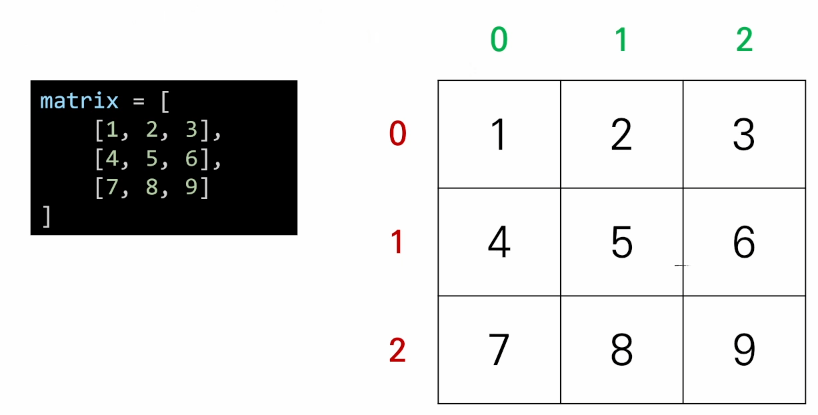

# 0803

linear algebra [youtube] : 행렬 벡터 강의영상

### 이차원 리스트

- 이차원 리스트는 리스트를 원소로 가지는 리스트일 뿐이다.

  - 보기 좋게 변경하면 행렬(matrix)의 형태가 나온다!

  - 즉, 이차원 리스트는 행렬이다.

    

- 반복문으로 행렬 만들기.

  ```python
  for _ in range(n): 			# 0을 m개를 n번 (행)
      matrix.append([0]*m) 	# 0을 m개 (열)
      						# n x m 행렬 matrix
  matrix = [[0]*m for _ in range(n)] # 빈 리스트 컴프리헨션
  
  # [[]*m]*n 연산의 경우 정상적인 행렬이 불가능함.
  matrix = [[0] * m] * n 		# 동일한 주소의 리스트가 행만큼 반복됨
  
  ```

  