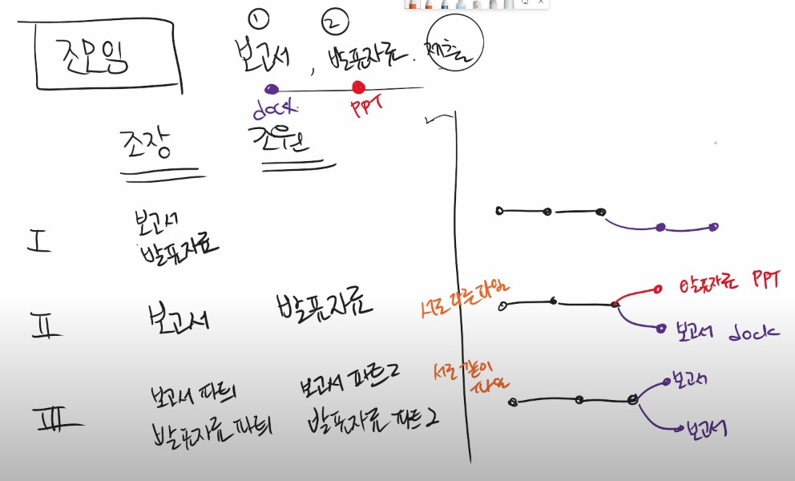
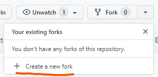
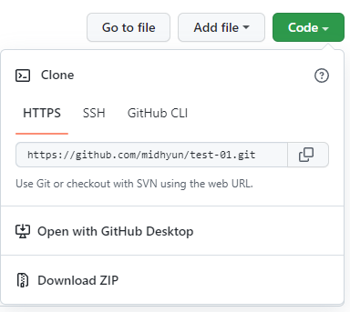
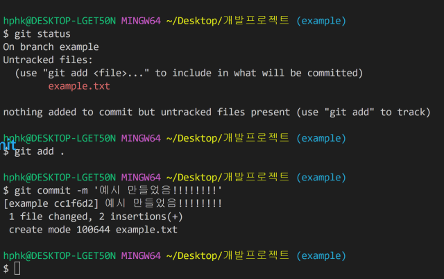
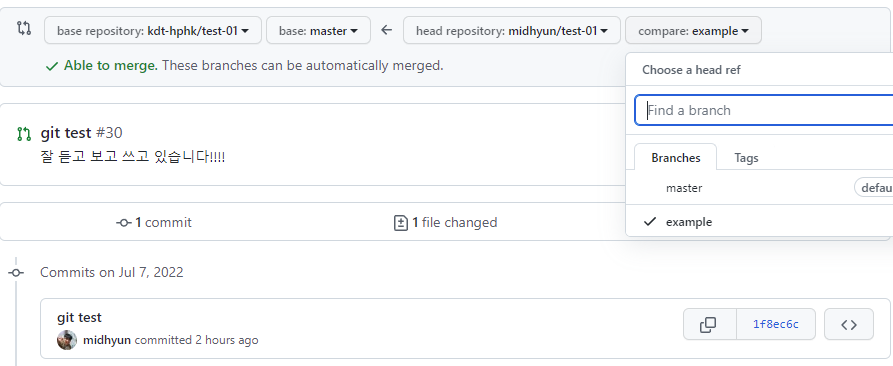

# 0707

## 오전


- Reviewing // 

  - Git add / Git commit -m '<msg>' / Git push <원격저장소> <브랜치>

    Git pull / Git clone 

- $ git clone <클론주소 / 클론 주의  : 원격 저장소 이름의 폴더가 생성

- download zip / git clone의 차이 .git (master) 의 유무 즉 zip 파일은 현재의 버전만을 가져옴

- but, clone의 경우 모든 버전(커밋)들을 함께 가져옴

clone은 저장소를 가져오고 pull은 변경된 커밋을 가져옴.

## 오후

### Branch basic commands

- Branch Switch

  - `git init`  : 저장소 사용 시작 ! 


  - `touch README.md`  > `git add README.md` > `git commit -m 'Add README'` 


  - `git branch`(1.브랜치 조회) > `git branch example` (2.'example'라는 브랜치 생성) > `git checkout example` (3. switch branch) 


  - `touch example.txt` > `git add example.txt` > `git commit -m 'example'` > `git checkout master` : exam 브랜치에서 작업 후 master로 브랜치 switch

---------

### Branch Merge

- `git branch merge`
- `git branch -d example`

#### 1. 업무 분배

- 조모임 // 보고서, 발표자료  (조장, 조원)

- 

- **Situation 1.** fast-foward

  - root-commit 발생

    

  - Working & Commit

    ```bash
    $ git branch
    $ git checkout feature/home
    $ git touch home.txt
    $ git add .
    $ git commit -m 'Complete Home!!!!'
    $ git log --oneline
    
    ```

  - master branch

    ```bash
    (feature/home) $ git checout master
    (master) $ git log --oneline
    ```

  - merge master

    ```bash
    $ git merge feature/home
    ```

- **Situation 2.** merge commit

  - feature/about branch 'create & move'

    ```bash
    $ git branch -b feature/about
    ```

  - Working & Commit

    ```bash
    $ touch
    $ git add
    $ git commit
    ```

  - Move master & Work, Commit

    ```bash
    $ git checkout master 
    $ touch
    $ git add
    $ git commit
    ```

  - master merge

    ```bash
    $ git merge feature/about # $ git merge <branch>
    $ git branch -d feature/about # $ del <branch>
    ```

    > new commit create

- **Situation 3** . 

  - Create <branch>

    ```bash
    (master) $ git checkout -b feature/test
    ```

  - Working & Commit

    ```bash
    $ git checkout feature/test 
    # README.md 파일 생성하기 (feature/test)
    $ touch
    $ git add 
    $ git commit
    ```

  - Move `master` > `commit` > `merge`

    ```bash 
    $ git checkout master
    # README.md // 파일 열어서 수정
    (master) $ git add RAEDME.md
    (master) $ git commit -m '<msg>'
    
    $ git merge feature/test
    $ git status # conflicts error
    ```

  - Conflict check

    ```bash
    $ merge commit 
    ```

    - 자동으로 작성된 커밋 메시지를 확인하고, `esc`를 누른 후 `:wq`를 입력하여 저장 및 종료를 합니다.

    - `w` : write

    - `q` : quit

    > 직접 충돌을 해결 후에 add, commit

  - Commit check

    ```bash
    (master) $ git log --oneline --graph
    ```

#### 2.**Github Pull request PR** 

1. *Create a New  **fork***

    

2. *Code clone*

   

3. *Working Code*

   `git add`  > `git commit`  > `git push` 

   

4. *Pull Request*

   \* ❗ head repository <branch> ➡ base repository <branch>

   

5.  *Comfirm base.*

----

### Github Flow 기본 원칙

1. **master branch는 반드시 배포 가능한 상태여야 한다.**
2. **feature branch는 각 기능의 의도를 알 수 있도록 한다.**
3. **commit message 는 매우 중요하며, 명확하게 작성한다.**
4. **pull request를 통해서 협업을 진행한다.**
5. **변경사항을 반영하고 싶다면, master branch에 병합한다.**

---

### 

