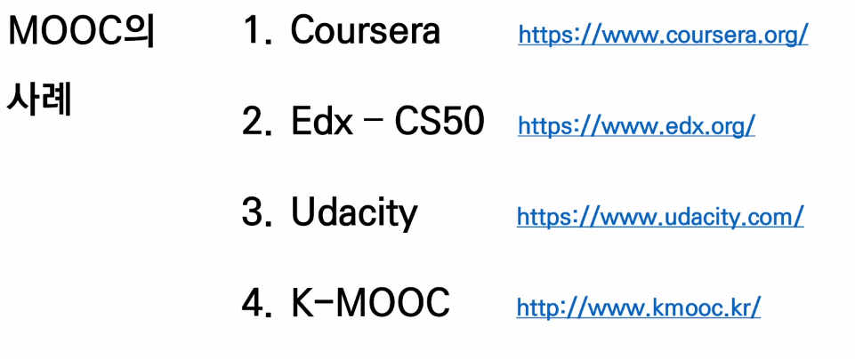
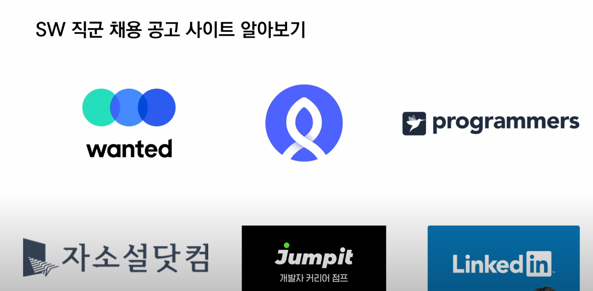
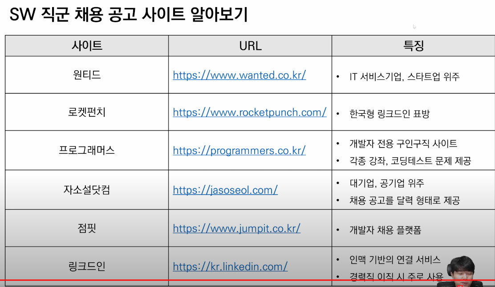

0708

## 🌈AM

> 시장 & 채용 트렌드 분석.. 특강

1. Reviewing
   - discord 쓰레드 사용하기
   - 질문 남길때 코드 블럭으로 남기면 명확함
   - restore , restore --staged
   - Error에 대처 - 한단계씩 뒤에서 찾는다
2. 취업 트렌드

- Process

  - Seires 1 시장 & 채용 트렌드 분석
    - 시작 분석
    - 채용 트렌드 분석 : 변화한 채용 시장에서의 새로운 준비
    - 직군/직무 분석 : 채용공고 리서치

  - Seires 2 서류 전형 분석
    - 서류 전형 트렌드 분석 : 서류전형 & 자소서 문항 리서치
    - 기업 분석 : 기업 맞춤형 자기소개서 준비
    - 포트폴리오 분석

  - Seires 3 코딩 테스트 분석
    - 코딩 테스트 트렌드 분석
    - 코딩 테스트 플랫폼 분석 및 준비
    - 기업별 코딩 테스트 분석 및 준비

  - Seires 4 면접(인터뷰) 전형 분석
    - 면접 트렌드 분석
    - 기술 면접 분석
    - 인성 & 컬처핏 면접 분석

  - Seires 5 종합 분석 & 준비

- 공채 시대의 종말.

  - 대 경력직의 시대, 공채 => 수시채용
    - Why? 공채의 스펙요소가 현업과 관련성이 낮다.
    - 즉각적으로 현업에 투입하기 위해.

  > 네카라배토당 , 삼현엘

- **"프로젝트"**

  > 프로젝트 중심의 자기소개서

  - 자기를 소개하는 것이 아닌, 자기가 한것을 소개하는

    **== 개발자들의 클라우드, 이력서, 메모장**

- MIND

  - 학습 '전' 마인듯 셋을 다시 잡아야 한다. 

    - 직장 < 커리어 < 삶
    - ~~\*\*개발자가 되고싶다~~, <u>나는 \*** 개발자 이다 !</u>
    - So, ***개발자는 어떻게 학습할까?
      - 회사에서 어떻게 일하는지 공개되어 있다. (Youtube, slash 21)

  - 

  - **MOOC** (Massive Open source Online Courses)

    - Coursera https://www.coursera.org/

    - **Edx - CS50**  https://www.edx.org/

    - **Udacity** https://www.udacity.com

    - K-MOOC https://www.kmooc.kr/

      > KDT과정에 여유가 있다면, 멘토님에게 Challenging

    - codecademy https://codecademy.com/

  - 학 습 ( 이해, 익숙 )

    - 학습을 하면 > Github에 기록 > 결과중심의 학습 중요✔
    - Product > Github 

- **취업 절대 공식** (3가지 中 1이상)

  > 채용자의 입장에서 생각해보기.

  - **Github TIL을 1.5년 이상 지속**

  - **✔(나의 언어로) 타인에게 설명할 수 있는 SW 역량**

  - ✔**유저가 실사용 하는 프로젝트를 개발 & 유지보수**✔

    - user = 10명 이상  (쉽지 않음)

    `★꾸준히 하는것이 중요하다.★`

## 🌈PM

> 새로운 준비 방법 // 실습 

1. 동기부여! 

   - 분야를 고르자 ! ( Frontend / Backend  / DevOps / Data Scientist)

2. wanted / rocketpunch / programmers / jasoseol / jumpit / linkedin

   

> 채용 공고, 자격요건, 우대사항 분석

3. **정보가 있으면 Github에 push !!!**
