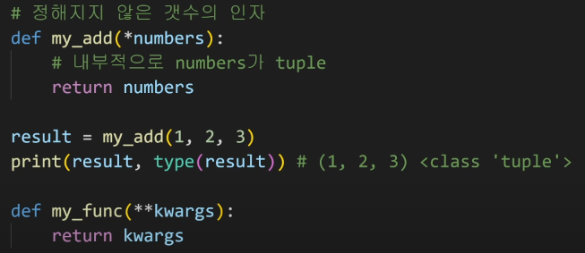
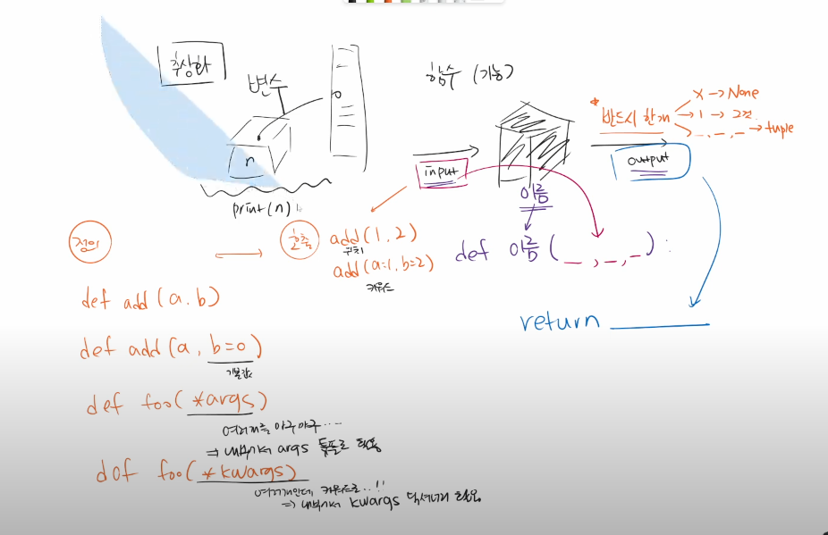

# 0713

> 🌈 AM

### 함수

- 개요

  - f(x) , 

  - 컴퓨터 (Computer) = Calculation + remember 

  - 명령이 중요하다.
    - 실제적으로 어떤 절차를 지나고 있는지
    - 어떠한 단계로 코드로 구현해 나아가는지

  - 변수와 타입, 
    - int. float, complex, bool
    - str, list, tuple, range
    - set, dictionary

  - len('happy!')

  - 코드를 간결하게 작성해야 하는 이유.
    - Decomposition : 기능을 분해, 재사용 가능
    - Abstraction : 복잡한 내용을 숨기고 ,기능에 집중하여 사용할 수 있음.(블랙박스) 재사용성, 가독성, 생산성

- Function 함수
  - 특정한기능을 하는 코드의 조각 모음
  - 필요시에 호출하여 사용함
  - 선언과 호출 > 입력 > 범위 > 결과값
- Custom Function 사용자 함수
  - 함수의 선언 : `def ` 
  - 들여쓰기를 통해 Function body(코드블록)을 작성함
  - parameter를 넘겨줄 수 있음
  - 동작 후에 return을 통해 결과값을 전달함.

```python
 # 함수는 함수명() 으로 호출
def foo():  # foo() 호출
    return True

def add(x,y):  # add(2,3)
    return x + y
```

- `return` vs `print`
  - `return` 은 값을 반환해줌
  - `print`는 출력만 해줌

- 함수의 입력 (Input)

  - `argument`

    - 함수 호출시 함수의 parameter를 통해 전달되는 값

    - 위치에 따라 함수 내에 전달됨

      

  - LEGB // scope // ..

    - Local - Enclosed - Global - Built_in 순서로 함수를 찾음


