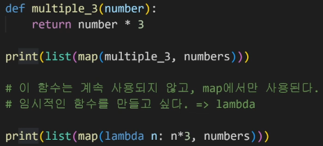

# 0721

> List

### List Comprehension

```python
cubic_list = []
for number in range(1, 4):
    cubic_list.append(number**3)
# list comprehension
cubic_list = [number**3 for number in range(1, 4)]
```

특정한 원소(요소)로 구성된 **리스트를 만들 때** 사용.

### Dictionary Comprehension

```python
cubic_dict = {}
for number in range(1,4):
    cubic_dict[number] = number ** 3
# Dictionary Comprehension
cubic_dict = {number: number**3 for number in range(1,4)}
```

간단한 형태의 **딕셔너리를 만들 때** 사용

### lambda [parameter]: 표현식

- 람다함수: 
  표현식을 계산한 결과값을 반환하는 함수로, 이름이 없는 함수여서 **익명함수** 라고도 불림.
  - return문을 가질 수 없음,
    간편 조건문 외 조건문이나 반복문을 가질 수 없음.



### filter()

iterable 한 모든 요소에 함수를 적용하고, 그 결과가 True인 것들을 filter object로 반환.

```python
list(map(filter(lamda n: n % 3 == 0,numbers)))
```


### 모듈

