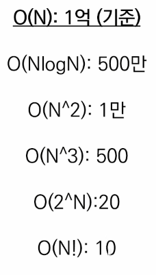

# 0727

### 시간 복잡도 & 빅오 표기법

- 효율적인 더 좋은 알고리즘을 작성하기 위해서 !
- 알고리즘의 소요 시간을 측정하기가 환경마다 시간이 다르기때문에 객관적인 지표가 필요했음. 기본 연산이 일어나는 횟수를 기준으로함.
- (일반적으로) 1초가 걸리는 입력의 크기

- 내장 함수, 메서드의 시간 복잡도도 확인할 필요가 있다.
  반복문 내에서 O(N)의 함수를 사용하면 이중 반복문과 같다.

### 문자열 String

- 문자열 슬라이싱
  - immutable (변경 불가능한)
  - string[:]
- 문자열 메서드
  - .split()
  - .strip(제거할 문자) : 문자열의 양쪽 끝에 있는 특정 문자를 모두 제거한 새로운 문자열 반환, 괄호 안에 아무것도 넣지 않으면 자동으로 공백을 제거 문자로 설정, 제거할 문자를 여러 개 넣으면 해당하는 모든 문자들을 제거
  - .find(찾는 문자) : 특정 문자가 처음으로 나타나는 위치(인덱스)를 반환
    찾는 문자가 없다면 -1 반환
  - .index(찾는 문자) : 특정 문자가 처음으로 나타나는 위치(인덱스)를 반환
    찾는 문자가 없다면 오류 발생
  - .count(개수를 셀 문자) : 문자열에서 특정 문자가 몇 개인지 반환
  - .replace(기존 문자, 새로운 문자) 문자열에서 기존 문자를 새로운 문자로 수정한 새로운 문자열 반환
  - .join(iterable) : 
- 아스키(ASCII) 코드 : 미국 정보교환 표준부호
  - ord(문자) : 문자의 아스키코드 넘버를 반환
  - chr(아스키넘버) : 아스키 넘버에 해당하는 문자를 반환