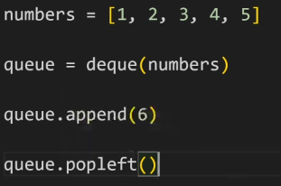

# 0801

### 스택, 큐 (Stack, Queue)

- Data Structure  데이터 구조 : 
  데이터를 다양한 방식으로 저장하고, CRUD 기능을 제공한다.
- 스택 : Stack , 데이터를 한쪽에서만 넣고 빼는 자료구조로 가장 마지막에 들어온 데이터가 가장 먼저 나가므로 LIFO(Last-in First-out, 후입선출) 방식
  - why? : 뒤집기, 되돌리기, 되돌아가기
  - 괄호 매칭, 함수 호출, 백트래킹, DFS
  - 완료 되지 않은 작업을 임시 저장.
  - 파이썬은 리스트(List)로 스택을 간편하게 사용할 수 있다!
  - 

- 큐 : Queue, 한 쪽 끝에서 데이터를 넣고, 다른 한 쪽에서만 데이터를 뺄 수 있는 자료구조 가장 먼저 들어온 데이터가 가장 먼저 나가므로 FIFO(First-in First-out, 선입선출) 방식

  - 덱(Deque, Double-Ended Queue) 자료구조, 양방향 삽ㅇ비, 추출이 모두 큐보다 훨씬 빠르다.

  - ```python
     from collections import deque
    ```

