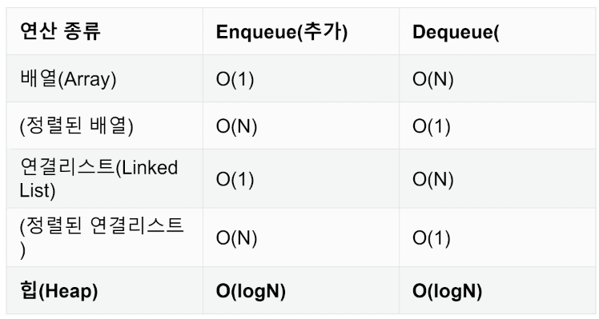
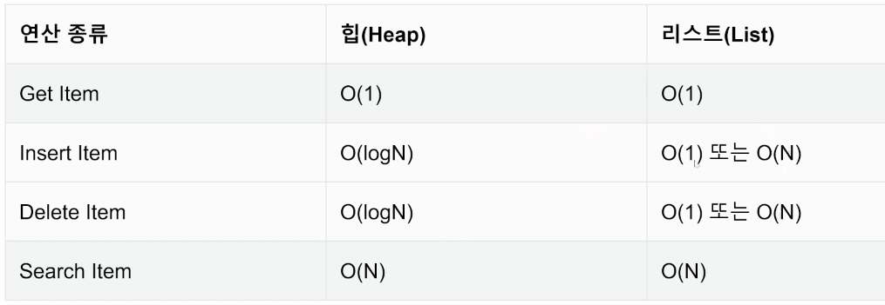
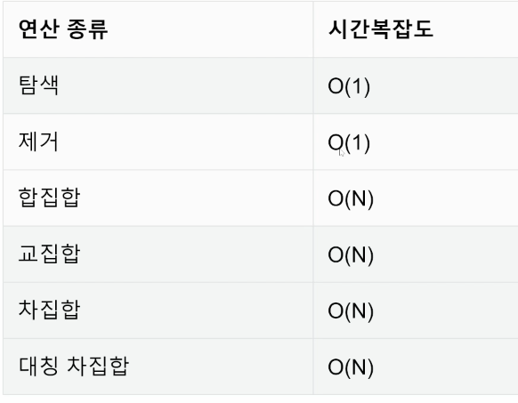

### 0802

### 힙(Heap), 셋(Set)

- **힙 Heap** : 일반적인 큐는 순서를 기준으로 가장 먼저 들어온 데이터가 가장 먼저 나가는 FIFO 방식

  - 순서가 아닌 다른 기준으로는? Heap이 필요한 경우 == Heap의 **Use Case**
    - *데이터가 지속적으로 정렬되야 하는 경우*
    - *데이터에 삽입 / 삭제가 빈번할 때*
  - 우선순위 큐 (Priority Queue)는 우선순위(중요도, 크기 등 순서 이외의 기준)를 기준으로 가장 우선순위가 높은 데이터가 가장 먼저 나가는 방식
  - 최대값 또는 최소값을 **빠르게** 찾아내도록 만들어진 **데이터구조**,
    완전 이진 트리의 형태로 **느슨한 정렬 상태를 지속적으로 유지**한다.
    힙 트리에서는 중복 값을 허용한다.
  - 힙에 원소를 추가할 때 (-item, item)의 **튜플 형태**로 넣어주면 튜플의 **첫 번째 원소를 우선순위로 힙을 구성**하게 된다. 이때 원소 값의 부호를 바꿨기 때문에, 최소 힙으로 구현된 heapq 모듈을 최대 힙 구현에 활용하게 되는 것이다.

- 우선수위 큐 (Priority Queue)

  - 순서가 아닌 우선순위를 기준으로 가져올 요소를 결정하는 큐
    ex) 1. 가중치가 있는 데이터 2. 작업 스케줄링 3. 네트워크

  - 큐를 구현하는 방법들, 데이터를 다루는 방식!
    배열(Array), 연결 리스트(Linked List), **힙(Heap)**

    

- 파이썬의 heapq 모듈

  - Minheap(최소힙)으로 구현되어 있음(가장 작은 값이 먼저 옴)

  - 삽입, 삭제, 수정, 조회 ***연산의 속도가 리스트보다 빠르다!***

    

  - | 메서드                     | `import heapq`                       |
    | -------------------------- | ------------------------------------ |
    | heapq.heapify()            | 힙으로 만들기.                       |
    | heapq.heappop(heap)        | heap에서 우선순위 높은 item을 꺼낸다 |
    | heapq.heappush(heap, item) | heap에 item을 넣는다.                |

- **셋 (set)**

  - 셋의 연산

  - | 메서드                                      |                  |
    | ------------------------------------------- | ---------------- |
    | set.add()                                   | Set 에 ()값 추가 |
    | set.remove()                                | Set 에 ()값 제거 |
    | \|(합, shift + \ ), -(차), &(교), ^(대칭자) | 집합 연산        |
  
  
  

  - Set은 언제 사용해야 할까?
    ex) 데이터의 중복이 없어야 할 때(고유값들로 이루어진 데이터가 필요할 때), 정수가 아닌 데이터의 삽입/삭제/탐색이 빈번히 필요할 때
  
    
  
  - 리스트에서는 어떤 값이 리스트에 있는지 확인하려면, 리스트의 값을 일일이 확인해야 한다. 반면 해시 테이블로 구현되어 있는 세트의 경우, 해당 값을 해시 함수에 넣어 인덱스에 접근함으로써, 아주 빠르게 해당 값이 있는지 여부를 확인할 수 있다. 따라서 세트에서 `x in s` 연산의 평균 시간 복잡도는 **O(1)**이 된다.
  
  

