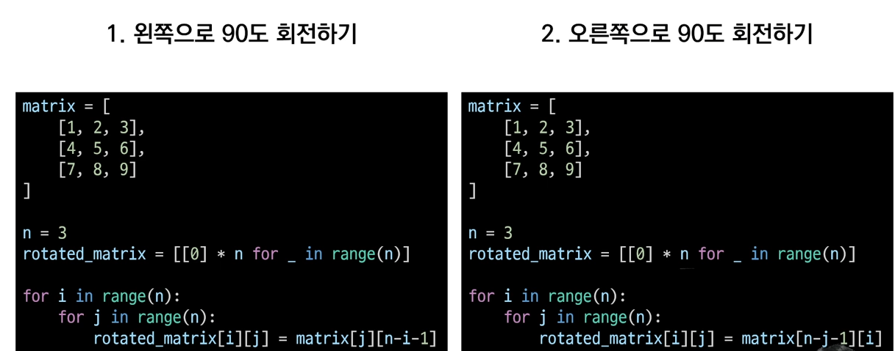
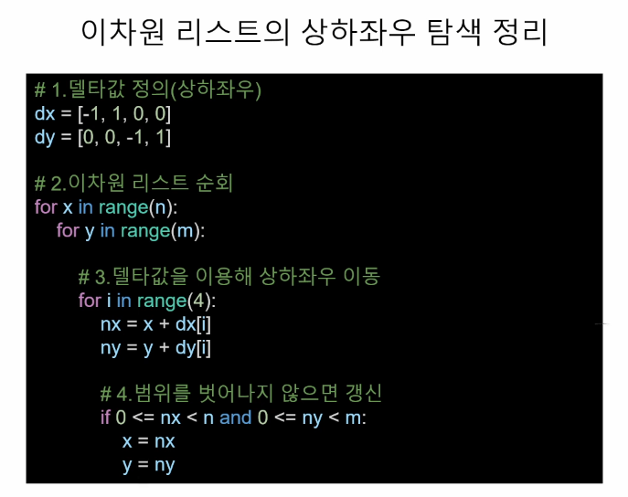

# 0808



### 완전탐색 1, Exhaustive Search

- Brute-force, 무식하게 다 해보기

  - 모든 경우의 수를 탐색하여 문제를 해결하는 방식
  - 가장 단순한 풀이 기법이며, 단순 조건문과 반복문을 이용해서 풀 수가 있다.
  - 복잡한 알고리즈 보다는, 아이디어를 어떻게 코드로 구현할 것인지가 중요하다.

- 블랙잭 문제를 통해 완전탐색 이해하기

  > https://www.acmicpc.net/problem/2798

```python
# N장의 카드 중에서 3장의 카드의 합이 M을 넘지 않는 가장 큰 값
# 모든 경우의 수를 순회 한다.
from collections import deque

N, M = map(int, input().split())
cards = deque(list(map(int, input().split())))
lst_sum = []
cnt = 0
for i in range(N-2):
    a = cards.popleft()
    for j in range(len(cards)-1):
        b = cards[j]
        for k in range(j+1,len(cards)):
            c = cards[k]
            d = a + b + c
            if d <= M:
                lst_sum.append(d)
            else:
                continue
print(max(lst_sum))
```

- Delta-Search 델타 탐색,
  - 이차원 리스트의 인덱스의 조작을 통해서 상하좌우 탐색을 한다.  이때 행과 열의 변량인 -1, +1 을 델타 값이라 한다.
  - 범위를 벗어나지 않는지 확인 및 갱신

