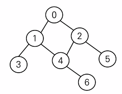
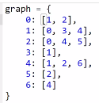

# 0809

### 그래프 (Graph)

1. 그래프에 대한 이해

- 정점(Vertex, Node)과 이를 연결하는 간선(Edge)들의 집합으로 이루어진 비선형 자료구조
  - 소셜 네트워크와 지하철 노선도 같이, 현실에 있는 개체 간의 관계를 나타내기 우해 사용한다.

- 그래프 관련 용어
  - 정점 : 간선으로 연결되는 객체이며, 노드(Node)라고도 한다.
  - 간선 : 정접 간의 관계(연결) 을 표현하는 선을 의미한다.
  - 경로 : 시작 정점부터 도착 정점까지 거치는 정점을 나열한 것을 의미한다.
  - 인접 : 두 개의 정점이 하나의 간선으로 직접 연결된 상태를 의미한다.

2. 그래프의 종류

- 무방향 그래프 (Undirected graph)
  - 간선의 방향이 없는 가장 일반적인 그래프
  - 간선을 통해 양방향의 정점 이동이 가능
  - 차수(Degree) : 하나의 정점에 연결된 간선의 개수
  - 모든 정점의 차수의 합 = 간선 수 x 2
- 유방향 그래프 (Directed graph)
  - 간선의 방향이 있는 그래프
  - 간선의 방향이 가리키는 정점으로 이동 가능
  - 차수 : 진입 차수와 진출 차수로 나누어짐

 

- 인접 행렬
  - 두 정점을 연결하는 간선이 없으면 0, 있으면 1을 가지는 행렬로 표현하는 방식
- 인접 리스트
  - 리스트를 통해 각 정점에 대한 인접 정점들을 순차적으로 표현하는 방식
  - 
