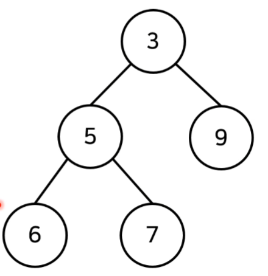
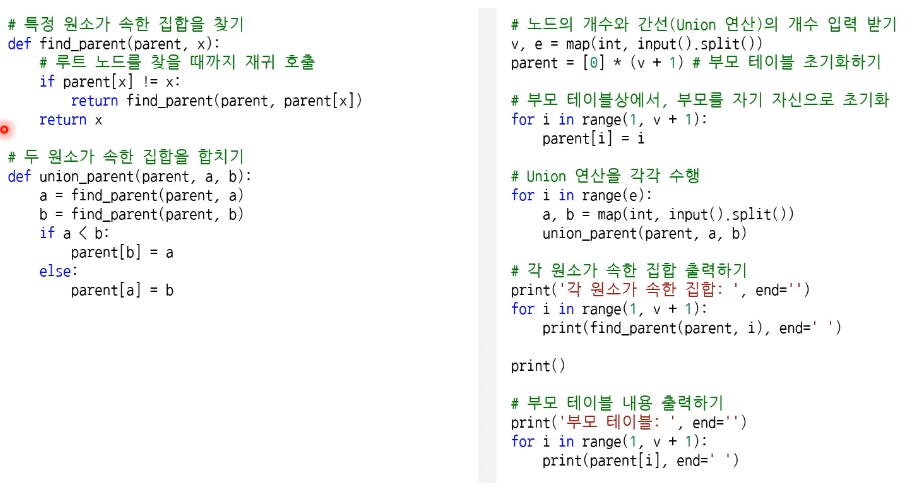

# 기본 알고리즘

### 스택과 큐

- 스택 : 박스를 쌓는 것과 유사함
  먼저 들어온것 위로 나중에 들어온 것을 쌓고 나중에 들어온 것부터 출력해나감.
- 큐 : 대기열과 유사함
  먼저 들어온 순서대로 출력함.

- 우선순위 큐: 우선순위가 가장 높은 데이터를 가장 먼저 삭제하는 자료구조

  - 데이터를 우선수위에 따라 처리하고 싶을 때 사용함.

  - Heap(힙) : 이진 트리 자료구조, 루트노드를 제거함

    - 최소 힙(min heap))

      - 루트 노드가 가장작은 값을 가짐.
      - 즉 가장 작은 값을 가진 데이터가 우선적으로 제거됨

    - 최대 힙(max heap)

      - 루트 노드가 가장 큰 값을 가짐.

      - 즉 가장 큰 값을 가진 데이터가 우선적으로 제거됨

        

    

  - 완전 이진 트리  : 루트 노드부터 시작하여 왼쪽 자식노드, 오른쪽 자식 노드 순서대로 데이터가 차례대로 삽입되는 tree 구조

  - Min-Heapify() 함수

    - (상향식) 부모 노드로 거슬러 올라가며 부모보다 자신의 값이 더 작은 경우에 위치를 교체합니다.
    - 힙에 새로운 원소가 삽입되었을 때 O(logN)의 시간 복잡도로 힙 성질을 유지하도록 함.

- 트리 (Tree)
  - 가계도와 같은 계층적인 구조를 표한할 때 사용할 수 있는 자료구조
    - 루트 노드 : 부모가 없는 최상위 노드
    - 단말 노드 : 자식이 없는 최하위 노드
    - 크기 : 트리에 포함된 모든 노드의 개수
    - 깊이 : 루트 노드로부터의 거리
    - 높이 : 깊이 중 최댓값
    - 차수 : 각 노드의 (자식 방향) 간선 개수
  - 이진 탐색 트리(Binary Search Tree)
    - 이진 탐색이 동작할 수 있도록 고안된 효율적인 탐색이 가능한 자료구조의 일종

### 특수한 목적의 자료구조: 바이너리 인덱스 트리

- BIT(Binary Index Tree): 2진법 인덱스 구조를 활용해 구간 합 문제를 효과적으로 해결해 줄 수 있는 자료구조를 의미.
  - 펜윅트리 라고도 함.

### 정렬 알고리즘

- 정렬 이란 데이털르 특정한 기준에 따라 순서대로 나열 하는 것.
- 일반적으로 문제 상화에 따라서 적절한 정렬 알고리즘이 공식처럼 사용됨.
- 선택 정렬
  - 처리되지 않은 데이터 중에서 가장 작은 데이터를 선택해 맨 앞에 있는 데이터와 바꾸는 것을 반복합니다.
  - N번 만큼 가장 작은 수를 찾아서 맨 앞으로 보내야 합니다.
  - 구현 방식에 따라 사소한 오차가 있을 수 있지만 (N^2 + N -2)/2로 표현할 수 있는데, 빅오 표기법에 따라서 O(N^2)이라고 작성합니다.
- 삽입 정렬
  - 처리되지 않은 데이터를 하나씩 골라 적절한 위치에 삽입합니다.
  - 선택 정렬 보다 구현 난이도가 높지만, 일반적으로 더 효율적임
  - O(N^2)의 시간보잡도를 가지며, 최선의 경우 O(N)의 복잡도를 가짐
- 퀵 정렬
  - 기준 데이터를 설정하고 그 기준보다 큰 데이터와 작은 **데이터의 위치를 바꾸는 방법**. 일반적인 상황에서 가장많이 사용되는 정렬 알고리즘 중 하나입니다. 병합졍렬과 더불어 대부분의 프로그래밍 언어의 정렬 라이브러리의 근간이 되는 알고리즘 입니다. 가장 기본적인 퀵 정렬은 **첫번째 데이터를 기준 데이터**로 설정합니다.
  - 이상적인 경우 분할이 절반씩 일어난다면 전체 연산 횟수로 O(NlogN)를 기대할 수 있습니다.
    - 너비X높이 = N logN = NlogN
-   계수 정렬
  - 특정한 조건이 부합할 때만 사용할 수 있지만 **매우 빠르게 동작**하는 정렬 알고리즘, **데이터의 크기 범위가 제한되어 정수 형태로 표현할 수 있을 때 사용 가능**

### 그래프 탐색의 기본, DFS와 BFS

- DFS
  - 깊이 우선 탐색이라고도 부르며 그래프에서 깊은 부분을 우선적으로 탐색하는 알고리즘.
  - 스택 자료구조 혹은 재귀함수를 이용하며, 구체적인 동작 과정은 다음과 같다.
    - 탐색 시작 노드를 스택에 삽입하고 방문처리를 한다.
    - 스택의 최상단 노드에 방문하지 않은 인접한 노드가 하나라도 있으면 그 노드를 스택에 넣고 방문처리 한다. 방문하지 않은 인접 노드가 없으면 스택에서 최상단 노드를 꺼낸다.
    - 더 이상 2번의 과정을 수행할 수 없을 때까지 반복한다.

- BFS
  - 너비 우선 탐색이라고도 부르며, 그래프에서 가까운 노드부터 우선적으로 탐색하는 알고리즘입니다.
  - BFS는 큐 자료구조를 이용하며, 구체적인 동작 과정은 다음과 같다
    - 탐색 시작 노드를 큐에 삽입하고 방문처리를 합니다.
    - 큐에서 노드를 꺼낸 뒤에 해당 노드의 인접 노드 중에서 방문하지 않은 노드를 모두 큐에 삽입하고 방문처리 합니다.
    - 더 이상 2번의 과정을 수행할 수 없을 때까지 반복합니다.

<<방문처리>> 가 뭔데!!!!!!!!!!!

### 최단 경로 문제

- 최단경로 알고리즘은 가장 짧은 경로를 찾는 알고리즘을 의미함.
  - 출발 노드 설정 > 테이블 초기화 > 방문하지 않은 노드 중 최단거리 선택 > 테이블 갱신 > 최단거리선택, 테이블갱신 반복

### 플로이드 워셜 알고리즘

### 벨만 포드 알고리즘

### 서로소 집합

