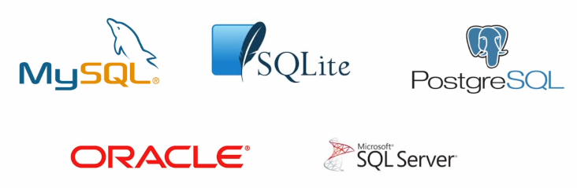

# Database

> 체계화된 데이터의 모임

### Database

- 장점

  - 중복 최소화, 무결성, 일관성, 독립성, 표준화, 보안 유지
  - 

  

### RDB

> 관계형 데이터 베이스(RDB, Relational Database)
>
> **키와 값들의 간단한 관계를 '표 형태'로 정리**한 데이터 베이스

##### 스키마(schema) 🤔

>  데이터 베이스에서 자료구조, 표현방법, 관계 등 전반적인 명세를 기술한 것

- 테이블 (table)
  - 열(컬럼/필드)와 행(레코드/값)의 모델을 사용해 조직된 데이터 요소들의 집합
  - 기본키 (Primary Key) : 각 행(레코드)의 고유 값
    - 반드시 설정해야 하며, 데이터베이스 관리 및 관계 설정시 주요하게 활용 됨

### RDBMS

> 관계형 데이터 베이스 관리 시스템



- SQLite : 
  서버 형태가 아닌 파일 형식으로 응용 프로그램에 넣어서 사용하는 비교적 가벼운 데이터베이스
  - 구글 안드로이드 운영체제에 기본으로 탑재된 데이터베이스이며, 임베디드 소프트웨어에도 많이 활용됨
  - 로컬에서 간단한 DB 구성을 할 수 있으며, 오픈소스 프로젝트이기 때문에 자유롭게 사용가능

### SQL

> (Structured Query Language) 관계형 데이터베이스 관리 시스템의 데이터관리를 위해 설계된 특수 목적으로 프로그램된 언어

- DDL - 데이터 정의 언어, DML - 데이터 조작(CRUD) 언어, DCL - 데이터 (권한)제어 언어

```sqlite
-- 테이블 '생성'
CREATE TABLE classmates (
	id INTEGER PRIMARY KEY,
    name TEXT
    adress TEXT
);
-- 테이블 목록 조회
.table
-- 특정 테이블 스키마 조회
.schema classmates
-- 데이터 '추가'
INSERT INTO classmates (name, age) VALUES ('홍길동', '23');
INSERT INTO classmates VALUES ('홍길동',23,'서울');
-- 데이터 '조회'
SELECT * FROM classmates;
-- rowid는 SQLite 에서 자동으로 제공하는 PK, 값이 1씩 증가
SELECT rowid, * FROM classmates LIMIT n OFFSET n;
-- 테이블 '삭제'
DROP TABLE classmates;
```

- CRUD - operation

  