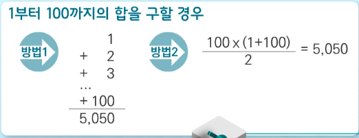
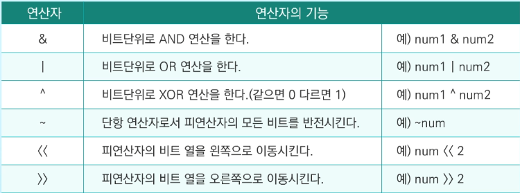

# SW Expert Academy

### 1. 코딩 교육 이슈

- 프로그래밍을 할줄 아는 사람과 아닌 사람의 차이는 20배 !
- 소프트웨어 문제 해결 역량이란
  - 프로그램 작성을 위한 많은 제약 조건들과 요구사항들을 이해하고 최선의 방법을 찾아내는 능력
  - 문제 해결 역량은 추상적인 기술이므로 암기로 푼다고 향상되지 않음
  - 새로운 언어, 프레임워크, 개발 방법론들의 조합 방법을 배워야 함
  - 프로그램 경험을 통해서 나아질 것이라는 기대를 하지 않아야 함.
  - 인위적 상황을 만들어 훈련 해야함
- 문제 해결 과정 단계
  - 주어진 문제를 읽고 이해하기
  - 문제를 익숙한 용어로 재정의 하기
  - 어떻게 해결할지 계획 세우기
  - 계획 검증하기
  - 프로그램으로 구현해서 테스트한다.
  - 풀이를 보고 개선할점이 있는지 확인한다.
- 문제 해결 전략 
  - 직관과 체계적인 접근이 필요함.
    1) 비슷한 문제를 풀어본 적이 있던가?
    2) 단순한 방법에서 시작할 수 있을까?
    3) 문제를 단순화 할 수 있을까? 그림으로, 수식으로 표현할 수 있을까?
    4) 문제를 분해 할 수 있을까?
    5) 뒤에서부터 생각해서 문제를 풀 수 있을까?
    6) 특정 형태의 답만을 고려할 수 있을까?

### 2. 알고리즘 복잡도

- 알고리즘 : 유한한 단계를 통해 문제를 해결하기 위한 절차나 방법
  				  주로 컴퓨터 용어로 쓰이며, 컴퓨터가 어떤 일을 수행하기 위한 단계적 방법
  				  어떠한 문제를 해결하기 위한 절차.

- 알고리즘의 효율

  - 같은 문제에 대한 알고리즘들이 구현되어 컴퓨터에서 실행되는 경우, 입력이 커질수록 알고리즘 효율에 따라 실행 시간의 차이 발생,
  - 공간적 효율성 : 얼마나 많은 메모리 공간을 요하는가?
  - 시간적 효율성 : 얼마나 많은 시간을 요하는가 ?

  - 시간 복잡도는 하드웨어 환경에 따라 처리시간이 달라지고, 소프트웨어 환경에 따라서도 달라지므로 환경적 차이로 분석이 어려울 수 있음,
    따라서 점근적 표기를 사용함.
  - Big-Oh 표기 , 점근적 상한을 나타냄 다항식의 최고차항만 표현함
  - Big-Omega 표기, 점근적 하한을 의미, 다항식의 최고차항만 표시함.

  - theta 표기 O-표기와 Omega 표기가 같을때 사용

### 3. 비트 연산

- 1 >> n  | 2^n 과 같음,
- 엔디안 : 컴퓨터의 메모리와 같은 1차원의 공간에 여러 개의 연속된 대상을 배열하는 방 법을 의미하며 HW 아키텍처마다 다름
  주의 : 속도 향상을 위해 바이트 단위와 워드 단위를 변환하여 연산할 때 올바로 이해하지 않으면 오류를 발생시킬 수 있음