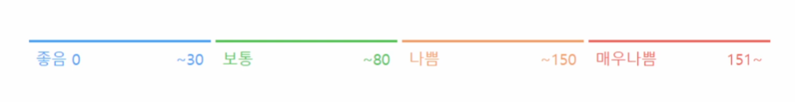
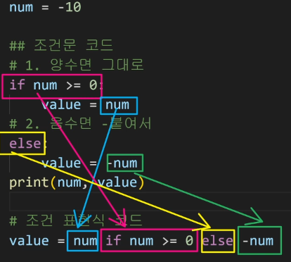
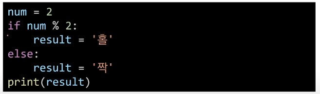
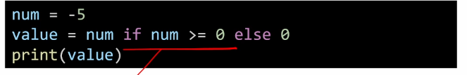
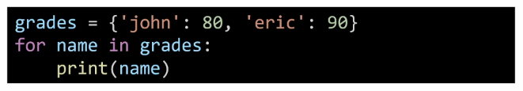
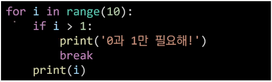
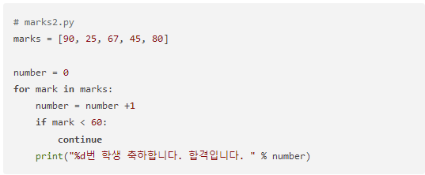
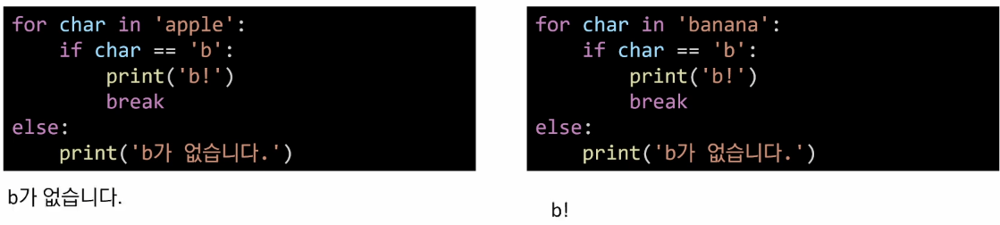

# Control flow statements

> 제어문


### if 조건문

> "조건문" 이란 참과 거짓을 판단하는 문장을 말한다.

```python
a=10
if a >= 0:
    print('양수')
else:
    print('음수')
print(a)
```

- 조건문을 통해 변수 num의 값의 홀수/짝수 여부를 출력하시오.

  - 이때 num은 input을 통해

    ```python
    num = int(input())
    if num%2 == 0 :
        print('짝수')
    elif num%2 == 1 :
        print('홀수')
    ```

    > 형변환에 주의하자 ! 숫자형에 숫자형 연산, 문자형에 문자형 연산

- 복수 조건문

  - if 조건, elif 조건, else // 조건1 : 코드블럭 1, 조건2 : 코드블럭 2 ...

    

    ```python
    # 미세먼지 농도에 따른 등급을 출력
    dust = int(input())
    if dust > 150 :
        if dust > 300 :
            print('실외활동을 자제하세요.')
        print('매우나쁨')
    elif dust > 80 :
        print('나쁨')
    elif dust > 30 :
        print('보통')
    else :
        print('좋음')
    # dust > 300 :
    
    # 실외활동을 자제하세요
    
    # 매우나쁨
    
    ```

    

- 조건 표현식

  - 

  - `value = num if num >= 0 else -num`

  

  - `result = '홀' if num % 2 else '짝' `

    

    ```python
    num = -5
    if num >= 0 :
        value = num
    else :
        value = 0
    print(value)
    ```

    

### 반복문

- While 문

  > **"무한 루프를 하지 않도록 종료조건이 반드시 필요"**

  - 조건식이 참인 경우 반복적으로 코드를 실행

    ```python
    while <expression>:
        # Code block
        
    a = 0
    while a < 5:
        print(a)
        a += 1
    print('끝') # a가 5번 출력됨
    ```

  - ex) 

    ```python
    # 1부터 사용자가 입력한 양의 정수까지의 총합을 구하는 코드를 작성하시오.
    num = 0
    result = 0
    n = int(input())
    while num < n :
        num += 1
        result += num
    print(result)
    ```

    

- for 문

  `for <변수명> in <iterable> :`

  - 시퀀스(string, tuple, list, range)를 포함한 순회 가능한 객체(iterable) 요소를 모두 순회함

    - 처음부터 끝까지 모두 순회하므로 별도의 종료조건이 필요하지 않음

  - enumerate 순회

    - [(0,'x'),(1,'y'), ... ] 인덱스넘버, 값 을 튜플로 묶어줌

  - 딕셔너리 순회

    - **기본적으로 key로 순회**하며, key를 통해 값을 활용

      key 값 입력됨 ! 

      

      `john` \\n `eric` 출력됨

- 반복제어

  - break 

    - 반복문 종료

      

      > 0 / 1 / 0과 1만 필요해! 

  - continue 

    

    - continue 이후의 코드블록은 수행하지 않고, 다음 반복을 수행

  - for-else 

    

    - 끝까지 반복문을 실행한 이후에 else문 실행
    - break로 중간에 중단되는 경우 else 문은 실행되지 않음