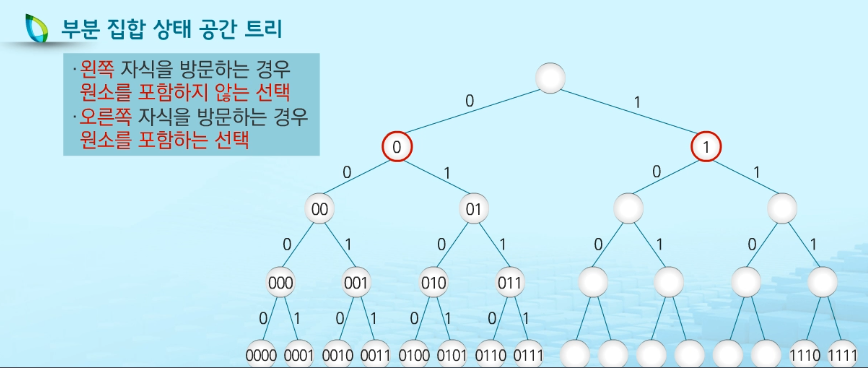

# 백트래킹

> 백트래킹 기법

### 백트래킹 기법

- 해를 찾는 도중에 막히면, 즉 해가 아니면 되돌아가서 다시 해를 찾아가는 기법
- 최적화 문제와 결정 문제를 해결할 수 있음
- 결정문제: 문제의 조건을 만족하는 해가 존재하는지의 여부를 yes, no로 답하는문제

> 미로찾기, 경로, 원소의 합이 조건에 맞는 부분집합이 존재하는지, 최단경로,
>
> n - Queen, Map coloring, 부분 집합의 합(Subset Sum) 문제 등,

- 초기 상태에서 목표 상태로 가는 경로를 탐색하는 기법
  1. 여러가지 선택지 들이 존재하는 상황에서 한가지 선택
  2. 선택이 이루어지면 새로운 선택지들의 집합 생성
  3. 선택을 반복하면서 최종 상태에 도달
- 트리의 루트로부터 당첨이라는 단말 노드까지 가는 경로 찾기
  - 당첨 노드까지 가기 위한 모든 경로에 대해서 탐색,
    - 루트에서 갈 수 있는 노드 선택
    - 꽝 노드까지 도달하면 최근의 선택으로 되돌아와서 다시 시작
    - 루트까지 돌아갔을 경우 더 이상 선택지가 없으므로 찾는값이 없다.
- 상태 공간 트리
  - 해를 찾기위한 선택의 과정을 트리로 표현
  - 트리의 내부 노드는 최종 상태로 가는 중간 상태를 나타냄
  - 트리의 단말 노드는 하나의 후버해에 대한 최종 상태가 됨
  - 상태 공간 트리를 탐색하는 것은 모든 후보해들을 탐색하는 것
  - 트리를 깊이 우선 탐색하는 방법이 백트래킹 알고리즘의 기본 형태
- 백트래킹과 깊이 우선 탐색과의 차이
  - 백트래킹
    - 어떤 노드에서 출발하는 경로가 해결책으로 이어질 것 같지 않으면 더 이상 그경로를 따라가지 않음으로써 시도의 횟수를 줄임
    - 백트래킹은 가지치기로 불필요한 경로 조기에 차단
    - 백트래킹 알고리즘 적용으로 일반적으로 경우의 수가 줄어들게 되어 처리 가능 - 최악의 경우 여전히 지수함수 시간 을 필요로 하므로 처리 불가능
  - 깊이 우선 탐색
    - 모든 경로 추적
    - 경우의 수가 너무 많은 경우 처리 불가능
      - N! 가지의 경우의 수를 가진 문제는 경우의 수가 너무 많아져서 처리 불가능

### 8-Queens 문제

- 8x8 체스판 안에 서로를 공격할 수 없도록 배치하는 모든 경우를 구하는 문제

- 후보해의 수 > 64 C 8 , 44억개

- 실제 해의 수는 92개

  - 44억개가 넘는 후보해의 수에서 92개를 최대한 효율적으로 찾아내기

  - 유망성을 검사 한후 유망하지 않을 경우 해당 노드의 부모로 되돌아가 다음 자식 노드로 감

- 알고리즘의 진행 절차

  - 상태 공간 트리에 대한 깊이 우선 탐색 실시
  - 방문하는 노드가 유망한지 여부 점검
    - 노드의 유망성 판단 방법은 해를 찾으려는 문제에 따라 달라짐
  - 만일 선택한 노드가 유망하지 않을 경우, 해당 노드의 부모 노드로 돌아가서 검색 계속 진행

``` python
# 일반적인 백트래킹 알고리즘
def checknode(v): # node
    if promising(v):					#1
        if there is a solution at v:	#2
            write the solution			#3
        else:
            for u in each child of v:	#4
                checknode(u)			#5
```


### 부분 집합

- Power set 생성 방법
  - 어떤 집합의 공집합과 자기 자신을 포함한 모든 부분집합
  - 구하고자 하는 어떤 집합의 원소 개수가 n일 경우 부분집합의 개수는 2**n
  - 1 또는 0 값을 가지는 항목들로 구성된 n개의 리스트를 만드는 방법을 이용
  - 리스트의  i번째 항목은 i번째의 원소가 **부분집합에 포함되는지 여부를 표현**



- 부분집합의 상태 공간 트리 > 깊이 우선 탐색으로 모든 부분집합 생성 알고리즘

```python
a = [0...n-1] # 집합에 대한 비트 표현 저장, 크기는 원소의 수
k = int() 	  # 선택한 횟수(현재 노드의 높이), n : 모든 선택수(트리의 높이)

def subset(a,k,n):
    if k == n:
        process_solution(a,n)
    else:
        a[k] = 0
        subset(a, k + 1, n)
        a[k] = 1
        subset(a, k + 1, n)

```

### 순열에 대한 상태공간 트리

- 원소의 개수가 n 개일 경우 n번의 선택을 지나야 하나의 순열이 생성됨
  - 노드 방문 시마다 저장 내용은 원소를 가리키는 인덱스 값 저장
  - 같은 원소 수를 가지는 집하에 대해 부분 집합과 순열의 상태 공간 트리 높이 같음
  - 순열의 경우는 높이가 다른 노드들은 선택지의 수가 동일하지 않음
  - 높이가 증가하면서 선택지의 수 하나씩 감소
- 원소 개수가 4개인 경우 모든 순열 생성 과정
  - 