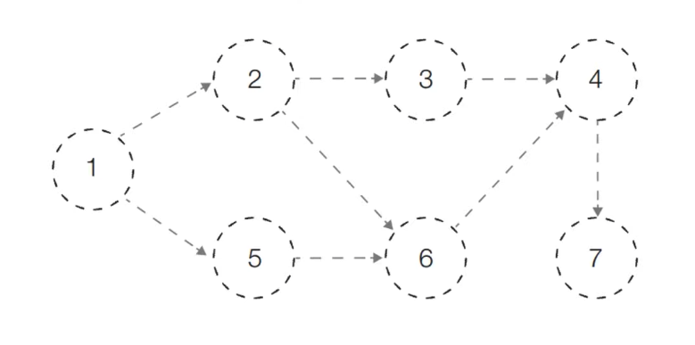

## 위상 정렬

- 사이클이 없는 방향 그래프의 모든 노드를 **방향성에 거스르지 않도록 순서대로 나열**하는 것을 의미
- **예시)** 선수과목을 고려한 학습 순서 설정


- 위 세 과목을 모두 듣기 위한

   

  적절한 학습 순서

  는?

  - 자료구조 → 알고리즘 → 고급 알고리즘 (O)
  - 자료구조 → 고급 알고리즘 → 알고리즘 (X)

------

## 진입차수와 진출차수

- **진입차수(Indegree):** 특정한 노드로 들어오는 간선의 개수
- **진출차수(Outdegree):** 특정한 노드에서 나가는 간선의 개수


------

## 위상 정렬 알고리즘

- 큐

  를 이용하는

   

  위상 정렬 알고리즘의 동작 과정

  은 다음과 같다

  1. 진입차수가 0인 모든 노드를 큐에 넣는다
  2. 큐가 빌 때까지 다음의 과정을 반복한다
     1. 큐에서 원소를 꺼내 해당 노드에서 나가는 간선을 그래프에서 제거한다
     2. 새롭게 진입차수가 0이 된 노드를 큐에 넣는다

**=>** 결과 적으로 **각 노드가 큐에 들어온 순서가 위상 정렬을 수행한 결과**와 같다

------

### 위상 정렬 동작 예시

- 위상 정렬을 수행할 그래프를 준비한다
  - 이때 그래프는 **사이클이 없는 방향 그래프 (DAG)**여야 한다


- [초기 단계]

   

  초기 단계에서는

   

  진입차수가 0인 모든 노드

  를 큐에 넣는다

  - 처음에 **노드 1**이 큐에 삽입된다


- [Step 1]

   

  큐에서

   

  노드 1

  을 꺼낸 뒤에

   

  노드 1

  에서 나가는 간선을 제거한다

  - 새롭게 **진입차수가 0이 된 노드**들을 큐에 삽입한다


- [Step 2]

   

  큐에서

   

  노드 2

  를 꺼낸 뒤에

   

  노드 2

  에서 나가는 간선을 제거한다

  - 새롭게 **진입차수가 0이 된 노드**들을 큐에 삽입한다


- [Step 3]

   

  큐에서

   

  노드 5

  를 꺼낸 뒤에

   

  노드 5

  에서 나가는 간선을 제거한다

  - 새롭게 **진입차수가 0이 된 노드**들을 큐에 삽입한다


- [Step 4]

   

  큐에서

   

  노드 3

  를 꺼낸 뒤에

   

  노드 3

  에서 나가는 간선을 제거한다

  - 새롭게 **진입차수가 0이 된 노드**들을 큐에 삽입한다


- [Step 5]

   

  큐에서

   

  노드 6

  을 꺼낸 뒤에

   

  노드 6

  에서 나가는 간선을 제거한다

  - 새롭게 **진입차수가 0이 된 노드**들을 큐에 삽입한다


- [Step 6]

   

  큐에서

   

  노드 4

  를 꺼낸 뒤에

   

  노드 4

  에서 나가는 간선을 제거한다

  - 새롭게 **진입차수가 0이 된 노드**들을 큐에 삽입한다


- [Step 7]

   

  큐에서

   

  노드 7

  을 꺼낸 뒤에

   

  노드 7

  에서 나가는 간선을 제거한다

  - 새롭게 **진입차수가 0이 된 노드**들을 큐에 삽입한다


- [위상 정렬 결과]
  - 큐에 삽입된 전체 노드 순서: **1 → 2 → 5 → 3 → 6 → 4 → 7**





------

### 위상 정렬의 특징

- 위상 정렬은 DAG에 대해서만 수행할 수 있다

  - **DAG (Direct Acyclic Graph):** 순환하지 않는 방향 그래프

- 위상 정렬에서는

   

  여러 가지 답이 존재

  할 수 있다

  - 한 단계에서 큐에 새롭게 들어가는 원소가 2개 이상인 경우가 있다면 여러 가지 답이 존재한다

- 모든 원소를 방문하기 전에 큐가 빈다면 사이클이 존재

  한다고 판단할 수 있다

  - 사이클에 포함된 원소 중에서 어떠한 원소도 큐에 들어가지 못한다

- 스택을 활용한 DFS를 이용해 위상 정렬을 수행할 수도 있다

------

### 위상 정렬 알고리즘 (Python)

```
from collections import deque

# 노드의 개수와 간선의 개수를 입력 받기
v, e = map(int, input().split())
# 모든 노드에 대한 진입차수는 0으로 초기화
indegree = [0] * (v + 1)
# 각 노드에 연결된 간선 정보를 담기 위한 연결 리스트 초기화
graph = [[] for i in range(v + 1)]

# 방향 그래프의 모든 간선 정보를 입력 받기
for _ in range(e):
    a, b = map(int, input().split())
    graph[a].append(b) # 정점 A에서 B로 이동 가능
    # 진입 차수를 1 증가
    indegree[b] += 1

# 위상 정렬 함수
def topology_sort():
    result = [] # 알고리즘 수행 결과를 담을 리스트
    q = deque() # 큐 기능을 위한 deque 라이브러리 사용

    # 처음 시작할 때는 진입차수가 0인 노드를 큐에 삽입
    for i in range(1, v + 1):
        if indegree[i] == 0:
            q.append(i)

    # 큐가 빌 때까지 반복
    while q:
        # 큐에서 원소 꺼내기
        now = q.popleft()
        result.append(now)
        # 해당 원소와 연결된 노드들의 진입차수에서 1 빼기
        for i in graph[now]:
            indegree[i] -= 1
            # 새롭게 진입차수가 0이 되는 노드를 큐에 삽입
            if indegree[i] == 0:
                q.append(i)

    # 위상 정렬을 수행한 결과 출력
    for i in result:
        print(i, end=' ')

topology_sort()
```

입력 예시

```
7 8
1 2
1 5
2 3
2 6
3 4
4 7
5 6
6 4
```

출력 예시

```
1 2 5 3 6 4 7
```

------

### 위상 정렬 알고리즘 (Java)

```
import java.util.*;

public class Main {

    // 노드의 개수(V)와 간선의 개수(E)
    // 노드의 개수는 최대 100,000개라고 가정
    public static int v, e;
    // 모든 노드에 대한 진입차수는 0으로 초기화
    public static int[] indegree = new int[100001];
    // 각 노드에 연결된 간선 정보를 담기 위한 연결 리스트 초기화
    public static ArrayList<ArrayList<Integer>> graph = new ArrayList<ArrayList<Integer>>();

    // 위상 정렬 함수
    public static void topologySort() {
        ArrayList<Integer> result = new ArrayList<>(); // 알고리즘 수행 결과를 담을 리스트
        Queue<Integer> q = new LinkedList<>(); // 큐 라이브러리 사용

        // 처음 시작할 때는 진입차수가 0인 노드를 큐에 삽입
        for (int i = 1; i <= v; i++) {
            if (indegree[i] == 0) {
                q.offer(i);
            }
        }

        // 큐가 빌 때까지 반복
        while (!q.isEmpty()) {
            // 큐에서 원소 꺼내기
            int now = q.poll();
            result.add(now);
            // 해당 원소와 연결된 노드들의 진입차수에서 1 빼기
            for (int i = 0; i < graph.get(now).size(); i++) {
                indegree[graph.get(now).get(i)] -= 1;
                // 새롭게 진입차수가 0이 되는 노드를 큐에 삽입
                if (indegree[graph.get(now).get(i)] == 0) {
                    q.offer(graph.get(now).get(i));
                }
            }
        }

        // 위상 정렬을 수행한 결과 출력
        for (int i = 0; i < result.size(); i++) {
            System.out.print(result.get(i) + " ");
        }
    }

    public static void main(String[] args) {
        Scanner sc = new Scanner(System.in);

        v = sc.nextInt();
        e = sc.nextInt();

        // 그래프 초기화
        for (int i = 0; i <= v; i++) {
            graph.add(new ArrayList<Integer>());
        }

        // 방향 그래프의 모든 간선 정보를 입력 받기
        for (int i = 0; i < e; i++) {
            int a = sc.nextInt();
            int b = sc.nextInt();
            graph.get(a).add(b); // 정점 A에서 B로 이동 가능
            // 진입 차수를 1 증가
            indegree[b] += 1;
        }

        topologySort();
    }
}
```

------

### 위상 정렬 알고리즘 성능 분석

- 위상 정렬을 위해 차례대로 모든 노드를 확인하며 각 노드에서 나가는 간선을 차레대로 제거해야 한다
  - 위상 정렬 알고리즘의 시간 복잡도는 ***O(V + E)\*** 이다