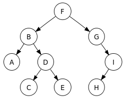

# 트리 순회

[전산학](https://ko.wikipedia.org/wiki/전산학)에서 **트리 순회**(Tree traversal)는 [트리 구조](https://ko.wikipedia.org/wiki/트리_구조)에서 각각의 노드를 정확히 한 번만, 체계적인 방법으로 방문하는 과정을 말한다. 이는 노드를 방문하는 순서에 따라 분류된다. 여기서 설명하는 [알고리즘](https://ko.wikipedia.org/wiki/알고리즘)은 [이진 트리](https://ko.wikipedia.org/wiki/이진_트리)에 대해서 작성되었지만, 다른 모든 트리에서도 일반화될 수 있다.


## 순회[[편집](https://ko.wikipedia.org/w/index.php?title=트리_순회&action=edit&section=1)]

[연결 리스트](https://ko.wikipedia.org/wiki/연결_리스트)와 1차원 [배열](https://ko.wikipedia.org/wiki/배열)과 같은 선형 자료 구조에서는 한 가지의 논리적인 순회 방법만이 존재하지만, 트리 구조의 순회에는 많은 방법이 존재한다. 이진 트리의 루트 노드에서 시작해서, 세 가지 주요 단계를 거치며 순회를 진행하는데, 그 단계에는 현재 노드를 방문하는 것, 왼쪽 자식 노드를 순회하는 것과 오른쪽 자식 노드를 순회하는 것이 있다. 이러한 과정은 [재귀](https://ko.wikipedia.org/wiki/재귀)로 쉽게 설명할 수 있다.

### 전위 순회[[편집](https://ko.wikipedia.org/w/index.php?title=트리_순회&action=edit&section=2)]

**전위 순회**(preorder)는 다음과 같은 방법으로 진행한다.

1. 노드를 방문한다.
2. 왼쪽 서브 트리를 전위 순회한다.
3. 오른쪽 서브 트리를 전위 순회한다.

전위 순회는 [깊이 우선 순회](https://ko.wikipedia.org/wiki/깊이_우선_탐색)(depth-first traversal)라고도 한다.

### 중위 순회[[편집](https://ko.wikipedia.org/w/index.php?title=트리_순회&action=edit&section=3)]

중위 순회(Inorder)은 다음의 순서로 진행된다.

1. 왼쪽 서브 트리를 중위 순회한다.
2. 노드를 방문한다.
3. 오른쪽 서브 트리를 중위 순회한다.

중위 순회는 대칭 순회(symmetric)라고도 한다.

### 후위 순회[[편집](https://ko.wikipedia.org/w/index.php?title=트리_순회&action=edit&section=4)]

**후위 순회**(postorder)는 다음과 같은 방법으로 진행한다.

1. 왼쪽 서브 트리를 후위 순회한다.
2. 오른쪽 서브 트리를 후위 순회한다.
3. 노드를 방문한다.

### 레벨 순서 순회[[편집](https://ko.wikipedia.org/w/index.php?title=트리_순회&action=edit&section=5)]

**레벨 순서 순회**(level-order)는 모든 노드를 낮은 레벨부터 차례대로 순회한다. 레벨 순서 순회는 [너비 우선 순회](https://ko.wikipedia.org/wiki/너비_우선_탐색)(breadth-first traversal)라고도 한다.

[](https://commons.wikimedia.org/wiki/File:Sorted_binary_tree.svg)

[이진 탐색 트리](https://ko.wikipedia.org/wiki/이진_탐색_트리)에서

- 전위 순회: F, B, A, D, C, E, G, I, H (root, left, right)
- 중위 순회: A, B, C, D, E, F, G, H, I (left, root, right)
- 후위 순회: A, C, E, D, B, H, I, G, F (left, right, root)
- 레벨 순서 순회: F, B, G, A, D, I, C, E, H

### 구현[[편집](https://ko.wikipedia.org/w/index.php?title=트리_순회&action=edit&section=6)]

```
preorder(node)
  print node.value
  if node.left ≠ null then preorder(node.left)
  if node.right ≠ null then preorder(node.right)
inorder(node)
  if node.left  ≠ null then inorder(node.left)
  print node.value
  if node.right ≠ null then inorder(node.right)
postorder(node)
  if node.left  ≠ null then postorder(node.left)
  if node.right ≠ null then postorder(node.right)
  print node.value
```

모든 구현은 트리의 높이에 비례한 [호출 스택](https://ko.wikipedia.org/wiki/호출_스택) 공간이 필요하다. 약하게 균형 잡힌 트리에서 이는 더욱 중요하다.

각각의 노드가 부모 포인터를 가지고 있거나 [스레드 이진 트리](https://ko.wikipedia.org/wiki/스레드_이진_트리)인 경우 [스택](https://ko.wikipedia.org/wiki/스택)을 쓸 필요가 없다. 스레드를 쓰는 경우, 중위 순회를 더 크게 개량할 수 있고, 전위 순회와 후위 순회에 필요한 부모 노드의 필요성을 되찾더라도 이것이 알고리즘에 기반한 간단한 스택보다 더 느려지게 된다.

스레드 트리를 중위 순회할 경우, 이런 식으로 할 수 있다.

```
inorder(node)
  while hasleftchild(node) do
    node = node.left
  do
    visit(node)
    if (hasrightchild(node)) then
      node = node.right
      while hasleftchild(node) do
        node = node.left
    else
      while node.parent ≠ null and node = node.parent.right
        node = node.parent
      node = node.parent
  while node ≠ null
```

스레드 이진 트리는 포인터가 자식 노드인지를 판단하는 부분이 추가된다.

### 큐 기반 레벨 순서 순회[[편집](https://ko.wikipedia.org/w/index.php?title=트리_순회&action=edit&section=7)]

레벨 순서 순회는 간단한 [큐](https://ko.wikipedia.org/wiki/큐_(자료_구조))로 구현할 수 있다. 아래는 그 [의사코드](https://ko.wikipedia.org/wiki/의사코드)이다. 이 구현에는 마지막 노드의 깊이에 비례한 공간이 필요하다. 이는 모든 노드 번호의 합계 / 2가 된다. 공간을 더욱 효율적으로 사용하고 싶으면 [반복 심화 깊이 우선 탐색](https://ko.wikipedia.org/w/index.php?title=반복_심화_깊이_우선_탐색&action=edit&redlink=1)(iterative deepening depth-first search)을 사용한다.

```
levelorder(root)
  q = empty queue
  q.enqueue(root)
  while not q.empty do
    node := q.dequeue()
    visit(node)
    if node.left ≠ null
      q.enqueue(node.left)
    if node.right ≠ null
      q.enqueue(node.right)
```

### 사용[[편집](https://ko.wikipedia.org/w/index.php?title=트리_순회&action=edit&section=8)]

#### 중위 순회[[편집](https://ko.wikipedia.org/w/index.php?title=트리_순회&action=edit&section=9)]

중위 순회는 특히 [이진 탐색 트리](https://ko.wikipedia.org/wiki/이진_탐색_트리)에서 사용되는데, 이진 탐색 트리의 설정에 따른 기본적인 순서에서 값을 반환해야 하기 때문이다. 왜냐하면, 이진 탐색 트리의 노드 n에서, n의 모든 왼쪽 서브 트리는 n보다 작고, n의 모든 오른쪽 서브 트리는 n보다 크거나 같다. 따라서, 만약 왼쪽 서브 트리를 순서대로 방문하게 된다면, 재귀 호출을 사용하고, n을 방문하고, 오른쪽 서브 트리를 순서대로 방문하여, n을 루트로 하는 모든 서브트리를 순서대로 방문하게 된다. 재귀 호출이 정확히 서브 트리를 순서대로 방문하는지 [구조적 귀납법](https://ko.wikipedia.org/w/index.php?title=구조적_귀납법&action=edit&redlink=1)의 수학적 원리를 사용하여 추측할 수 있다. 역순 중위 순회는 값을 내림차순으로 정렬하는 것과 비슷하다.

#### 전위 순회[[편집](https://ko.wikipedia.org/w/index.php?title=트리_순회&action=edit&section=10)]

전위 순회는 [이진 탐색 트리](https://ko.wikipedia.org/wiki/이진_탐색_트리)를 완전히 복사해서 만들 때 새로운 트리에 값을 집어넣는 동안에 흔히 사용한다. 또한 [전위 표기법](https://ko.wikipedia.org/wiki/폴란드_표기법)을 구하는데 사용할 수 있다. 식의 값을 계산할 때, 오른쪽에서 왼쪽으로 살펴보면서 원소를 [스택](https://ko.wikipedia.org/wiki/스택)에 넣는다. 연산자를 찾을 때마다, 스택 위에 있는 2개의 기호를 빼내고 그 연산자를 이용해 계산한 뒤 그 결과를 다시 스택에 넣는다. 예를 들면, 전위 표기법 식 * + 2 3 4 (중위 표기법으로는 (2 + 3) * 4)를 계산하는 방법은 다음과 같다.

| 남아있는 식 |     스택 |
| :---------: | -------: |
|  ∗ + 2 3 4  | <비었음> |
|   ∗ + 2 3   |        4 |
|    ∗ + 2    |      3 4 |
|     ∗ +     |    2 3 4 |
|      ∗      |      5 4 |
|     답      |       20 |

## 반복 순회[[편집](https://ko.wikipedia.org/w/index.php?title=트리_순회&action=edit&section=11)]

모든 재귀 알고리즘은 트리의 깊이에 비례한 스택 공간이 필요하다. 재귀적 순회는 여러 가지 잘 알려진 방법을 이용하여 반복적인 방법으로 변환할 수 있다. 아래의 예제는 재귀적인 방법을 사용하지 않는 후위 순회를 보여준다.

```
nonRecursivePostorder(rootNode)
  nodeStack.push(rootNode)
  while (! nodeStack.empty())
    currNode = nodeStack.peek()
    if ((currNode.left != null) and (currNode.left.visited == false))
      nodeStack.push(currNode.left)
    else
      if ((currNode.right != null) and (currNode.right.visited == false))
        nodeStack.push(currNode.right)
      else
        print currNode.value
        currNode.visited := true
        nodeStack.pop()
```

이 경우, 각각의 노드는 보통의 정보가 아닌 추가적인 visited 플래그가 필요하다. 다음 예제는 visited 플래그를 사용하지 않는 전위 순회 함수를 [자바](https://ko.wikipedia.org/wiki/자바_(프로그래밍_언어))로 구현한 것이다.

```
public void traverseTree(Node root) {
   Stack nodes = new Stack();
   nodes.push(root);
   Node currentNode;
   while (! nodes.isEmpty()){
      currentNode = nodes.pop();
      Node right = currentNode.right();
      if (right != null)
         nodes.push(right);
      Node left = currentNode.left();
      if (left != null)
         nodes.push(left);
      System.out.println("Node data: "+currentNode.data);
   }
}
```

만약 각각의 노드가 부모 노드의 정보를 가지고 있다면, 반복 순회는 스택이나 visited 플래그를 쓰지 않고도 구현할 수 있다.