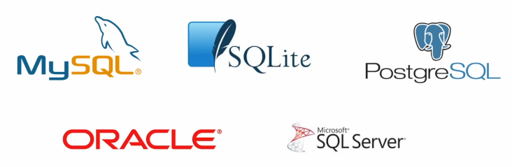

# Database

> 체계화된 데이터의 모임

### Database

- 장점

  - 중복 최소화, 무결성, 일관성, 독립성, 표준화, 보안 유지
  - 자료의 내용을 고도로 구조화 함으로써 검색과 갱신이 효율적임.
  - 즉, 자료 파일을 조직적으로 통합하여 자료항목의 중복을 없애고, 자료를 구조화하여 기억시켜 놓은 자료의 집합체
  

### RDB

> 관계형 데이터 베이스(RDB, Relational Database)
>
> **키와 값들의 간단한 관계를 '표 형태'로 정리**한 데이터 베이스

##### 스키마(schema) 

>  데이터 베이스에서 자료구조, 표현방법, 관계 등 전반적인 명세를 기술한 것

- 테이블 (table)
  - 열(컬럼/필드)와 행(레코드/값)의 모델을 사용해 조직된 데이터 요소들의 집합
  - 기본키 (Primary Key) : 각 행(레코드)의 고유 값
    - 반드시 설정해야 하며, 데이터베이스 관리 및 관계 설정시 주요하게 활용 됨

### RDBMS

> 관계형 데이터 베이스 관리 시스템



- SQLite : 
  서버 형태가 아닌 파일 형식으로 응용 프로그램에 넣어서 사용하는 비교적 가벼운 데이터베이스
  - 구글 안드로이드 운영체제에 기본으로 탑재된 데이터베이스이며, 임베디드 소프트웨어에도 많이 활용됨
  - 로컬에서 간단한 DB 구성을 할 수 있으며, 오픈소스 프로젝트이기 때문에 자유롭게 사용가능

### SQL

> (Structured Query Language) 관계형 데이터베이스 관리 시스템의 데이터관리를 위해 설계된 특수 목적으로 프로그램된 언어

- DDL - 데이터 정의 언어, DML - 데이터 조작(CRUD) 언어, DCL - 데이터 (권한)제어 언어

```sqlite
-- 테이블 '생성'
CREATE TABLE classmates (
	id INTEGER PRIMARY KEY,
    name TEXT
    adress TEXT
);
-- 테이블 목록 조회
.table
-- 특정 테이블 스키마 조회
.schema classmates
-- 데이터 '추가'
INSERT INTO classmates (name, age) VALUES ('홍길동', '23');
INSERT INTO classmates VALUES ('홍길동',23,'서울');
-- 데이터 '조회'
SELECT * FROM classmates;
-- rowid는 SQLite 에서 자동으로 제공하는 PK, 값이 1씩 증가
SELECT rowid, * FROM classmates LIMIT n OFFSET n;
-- 테이블 '삭제'
DROP TABLE classmates;
```

- CRUD - operation

- 명령어의 종류

| **명령어 종류**                                     | **명령어**                                                   | **설명**                                                     |
| :-------------------------------------------------- | :----------------------------------------------------------- | :----------------------------------------------------------- |
| 데이터 조작어(DML :  Data Manipulation Language     | SELECT                                                       | 데이터베이스에 들어 있는 데이터를 조회하거나 검색하기 위한 명령어를 말하는 것으로 RETRIEVE 라고도 함 |
| INSERTUPDATEDELETE                                  | 데이터베이스의 테이블에 들어 있는 데이터에 변형을 가하는 종류(데이터 삽입, 수정, 삭제)의 명령어들을 말함. |                                                              |
| 데이터 정의어(DDL : Data Definition Language)       | CREATEALTERDROPRENAMETRUNCATE                                | 테이블과 같은 데이터 구조를 정의하는데 사용되는 명령어들로 (생성, 변경, 삭제, 이름변경) 데이터 구조와 관련된 명령어들을 말함. |
| 데이터 제어어(DCL : Data Control Language)          | GRANTREVOKE                                                  | 데이터베이스에 접근하고 객체들을 사용하도록 권한을 주고 회수하는 명령어들을 말함. |
| 트랜잭션 제어어(TCL : Transaction Control Language) | COMMITROLLBACKSAVEPOINT                                      | 논리적인 작업의 단위를 묶어서 DML에 의해 조작된 결과를 작업단위(트랜잭션) 별로 제어하는 명령어를 말함. |


| 명령어 시작                                                  |                          |
| ------------------------------------------------------------ | ------------------------ |
| INSERT INTO 테이블이름 (컬럼1,2,...) VALUES (값1,2,...);<br />INSERT INTO 테이블이름 VALUES (값1,2,...); | 새로운 데이터 삽입(추가) |
| SELECT 컬럼1,2,... FROM 테이블이름 LIMIT n OFFSET n ; ( WHERE ...조건) | 저장되어있는 데이터 조회 |
| UPDATE 테이블이름 SET 컬럼1=값1, 컬럼2=값2 WHERE 조건;       | 저장되어있는 데이터 갱신 |
| DELETE FROM 테이블이름 WHERE 조건;                           | 저장되어있는 데이터 삭제 |

| 필드 제약 조건 |                                             |
| -------------- | ------------------------------------------- |
| NOT NULL       | NULL값 입력 금지                            |
| UNIQUE         | 중복 값 입력 금지(NULL 값은 중복 입력 가능) |
| PRIMARY KEY    | 테이블에서 반드시 하나. NOT NULL + UNIQUE   |
| FOREIGN KEY    | 외래키. 다른 테이블의 KEY                   |
| CHECK          | 조건으로 설정된 값만 입력 허용              |
| DEFAULT        | 기본 설정 값                                |

### WHERE 절

🗝` 비교 연산자 `

```sql
-- 숫자 혹은 문자 값의 대/소, 동일 여부를 확인하는 연산자
(=, >, >=, <, <=) 
```

🗝`논리 연산자`

```sql
-- 앞에 있는 조건과 뒤에 오는 조건이 모두 참인 경우
	AND
-- 앞의 조건이나 뒤의 조건이 참인 경우
	OR
-- 뒤에 오는 조건의 결과를 반대로
	NOT
	
-- EXAMPLE ( WARNING ) 우선순위를 생각해야 함
-- 1. 키가 175 인사람, 또는 183 이면서 80KG 인 사람
	WHERE HEIGHT = 175 OR HEIGHT = 183 AND WEIGHT = 80
-- 2. 키가 175 또는 183인 사람 이면서 몸무게가 80인 사람
	WHERE (HEIGHT = 175 OR HEIGHT = 183) AND WEIGHT = 80

-- 값1 과 값2 사이의 비교 (1 <= 비교값 <= 2)
	BETWEEN A AND B 
-- 목록 중에 값이 하나라도 일치하면 성공
	IN(A, B,...)
-- 비교 문자열과 형태 일치, 와일드카드( %: 0개 이상 문자, _:1개 단일 문자 )
	LIKE
-- NULL 여부를 확인할 때는 항상 = 대신에 IS를 활용
	IS NULL / IS NOT NULL
-- 부정 연산자
	!=, ^=, <>
	NOT A = B
	NOT A > B
```

🗝`연산자 우선순위`

```SQL
-- 1순위 : 괄호 ()
-- 2순위 : NOT
-- 3순위 : 비교 연산자, SQL
-- 4순위 : AND
-- 5순위 : OR 
```

### Aggregate Functions

> 집계 함수 - 값 집합에 대한 계산을 수행하고 단일 값을 반환, SELECT 구문에서만 사용됨.

🗝`함수 SELECT + FUNCTION`

```SQL
COUNT 	-- 그룹의 항목 수를 가져옴
AVG 	-- 모든 값의 평균을 계산
MAX		-- 그룹에 있는 모든 값의 최대값을 가져옴
MIN		-- 그룹에 있는 모든 값의 최소값을 가져옴
SUM		-- 모든 값의 합을 계산
```

🗝`LIKE`

```SQL
SELECT * FROM 테이블이름 WHERE 컬럼 LIKE '패턴'; -- 패턴: '02-%' 02- 로 시작하는 문자열, 와일드카드
-- 2% 	: 2로 시작하는 값
-- %2 	: 2로 끝나는 값
-- %2% 	: 2가 들어가는 값
-- _2% 	: 아무 값이 하나 있고 두 번째가 2로 시작하는 값
-- 1____: 1로 시작하고 총 4자리인 값
```

🗝`ORDER BY`

> 조회 결과 집합을 정렬, SELECT 문에 추가하여 사용, 오름차순 ASC(DEFAULT), 내림차순 DESC

```SQL
SELECT * FROM 테이블이름 ORDER BY 컬럼 ASC;
SELECT * FROM 테이블이름 ORDER BY 컬럼 DESC;
```


### 기본 함수와 연산

🗝`문자열 함수`

```sql
SUBSTR(문자열, START, LENGHT): 문자열 자르기
 -- 시작 인덱스는 1, 마지막 인덱스는 -1
TRIM(문자열), LTRIM(문자열), RTRIM(문자열) : 문자열 공백 제거
LENGTH(문자열) : 문자열의 길이
REPLACE(문자열, 패턴, 변경값) : 패턴에 일치하는 부분을 변경
UPPER(문자열), LOWER(문자열) : 대소문자 변경
```

🗝`숫자 함수`

```sql
ABS(숫자) : 절대 값
SIGN(숫자) : 부호 (양수 1, 음수 -1, 0 0)
MOD(숫자1, 숫자2) : 숫자 1을 숫자 2로 나눈 나머지
CEIL(숫자), FLOOR(숫자), ROUND(숫자, 자리) : 올림, 내림, 반올림
POWER(숫자1, 숫자2) : 숫자1의 숫자2 제곱
SQRT(숫자) : 제곱근
```

### GROUP BY

- ALIAS
  - 칼럼명이나 테이블명이 너무 길거나 다른 명칭으로 확인하고 싶을 때는 ALIAS를 활용
  - AS를 생략하여 공백으로 표현할 수 있음
  - 별칭에 공백, 특수문자 등이 있는 경우 따옴포로 묶어서 표기
- GROUP BY
  - "make a set of summary rows from a set of rows"
  - SELECT 문의 optional 절
  - 행 집합에서 요약 행 집합을 만듦
  - 선택된 행 그룹을 하나 이상의 열 값으로 요약 행으로 만듦
  - 문장에 WHERE 절이 포함된 경우 반드시 WHERE 절 뒤에 작성해야 함.

- ` SELECT * FROM users GROUP BY last_name; `
  - 지정된 컬럼의 값이 같은 행들로 묶음
  - 집계함수와 활용하였을 때 의미가 있음
  - 그룹화된 각각의 그룹이 하나의 집합으로 집계함수의 인수로 넘겨짐
  - GROUP BY 절에 명시하지 않은 컬럼은 별도로 지정할 수 없음
    - 그룹마다 하나의 행을 출력하게 되므로 집계 함수 등을 활용해야 함
  - GROUP BY의 결과는 정렬되지 않음
    - 기존의 순서와 바뀌는 모습도 있음
    - 원칙적으로 관계형 데이터베이스에서는 ORDER BY를 통해 정렬

### HAVING

- HAVING
  - 집계 함수는 WHERE 절의 조건식에서는 사용할 수 없음(실행 순서에 의해)
    - WHERE로 처리하는 것이 GROUP BY 그룹화보다 순서상 앞서 있기 때문
  - 집계 결과에서 조건에 맞는 값을 따로 활용하기 위해서 HAVING을 활용
    - `SELECT * FROM 테이블 이름 GROUP BY 컬럼1, 컬럼2 HAVING 그룹조건;

🗝`SELECT 문장 실행 순서`

**FROM => WHERE => GROUP BY => HAVING => SELECT => ORDER BY**

### ALTER TABLE

🗝ALTER TABLE

```SQL
-- 1. 테이블 이름 변경
ALTER TABLE table_name
RENAME TO new_name;
-- 2. 새로운 컬럼 추가
ALTER TABLE table_name
ADD COLUMN column_definition;
-- 3. 컬럼 이름 수정 (sqlite 3.35.0)
ALTER TABLE table_name
RENAME COLUMN current_name TO new_name;
-- 4. 컬럼 삭제 (sqlite 3.35.0)
ALTER TABLE table_name
DROP COLUMN column_name;

-- 2-2. 새로운 컬럼 추가 (주의)
NOT NULL 조건이 붙은 컬럼을 추가 할 땐 
DEFAULT 값을 설정해주어야 한다. (혹은 NOT NULL을 빼준다.)
```

### CASE

> 특정 상황에서 데이터를 변환하여 활용할 수 있음, ELSE를 생략하는 경우 NULL 값이 지정됨

```SQL
CASE
	WHEN 조건식 TEHN 식
	WHEN 조건식 TEHN 식
	ELSE 식
END
```

### 서브쿼리

> 특정한 값을 메인 쿼리에 반환하여 활용하는 것

- Subquery
  - 실제 테이블에 없는 기준을 이용한 검색이 가능함
  - 서브 쿼리는 소괄호로 감싸서 사용하며, 메인 쿼리의 칼럼을 모두 사용할 수 있음
  - 메인 쿼리는 서브 쿼리의 칼럼을 이용할 수 없음
- 단일행 서브쿼리
  - 서브쿼리의 결과가 0 또는 1개인 경우
  - 단일행 비교 연산자와 함께 사용 ( =, <. <=. >=, >, <> )
- 다중행 서브쿼리
  - 서브쿼리 결과가 2개 이상인 경우
  - 다중행 비교 연산자와 함께 사용( IN, EXISTS 등)
- 
