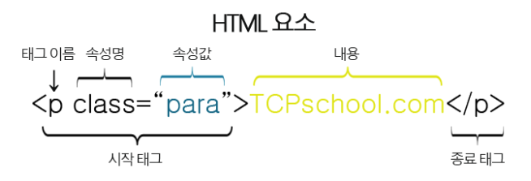

# Happy Web

> 웹페이지를 만드는 데 사용하는 언어, 모든 태그는 미리 정의되어 있으며, 각각의 태그와 속성을 사용. 

## HTML

> HyperText Markup Language, HTML 문서, 태그들로 구성됨, 각 태그는 디자인이나 기능을 결정함.

### Categories

- [HTML기초](#HTML-기초)
- [HTML 텍스트 요소](#텍스트-요소)
- [HTML 기본 요소](#기본-요소)
- [HTML 공간분할](#공간분할)

- [CSS 기초](CSS)
- [CSS 문법](#문법)


### HTML 기초

##### 태그(tag)

```html
<태그이름>   // 시작 태그
</태그이름>  // 종료 태그
1. 보통 시작태그와 종료태그의 한쌍으로 구성됨
2. 종료태그는 시작태그와 같지만 앞에 슬래시(/)가 있음
3. 태그에 따라 시작만 있고 종료가 없는 빈태그도 있음
ex)  <br> <hr>

메모장, 리눅스의vi 같은 기본 에디터로도 작성이 가능하며, 
.html 확장자로 저장하면 바로 브라우저로 확인이 가능함.
```

##### 기본 구조


```html
<!DOCTYPE html>  # 현재 문서가 HTML5문서임을 명시함.
<html> 			 # HTML 문서의 루트(root) 요소를 정의함.
    <head>		 # 문서의 "메타데이터"를 정의함.
        <title>HTML 문서의 제목</title> # 웹 브라우저의 툴바, 즐겨찾기의 제목, 검색엔진의 결과 제목
        <body>
            # 웹 브라우저를 통해 보이는 내용 (content) 부분.
            <h1>
                제목 헤딩1
            </h1>
            <p> 단락(paragraph)을 나타냄
        </body>
    </head>
</html>
```

> 메타데이터(metadata) : 문서에 대한 정보로 웹 브라우저에는 직접적으로 표현되지 않는 정보
>
> ```html 
> <title>,<style>,<meta>,<link>,<script>,<base> 태그 등을 이용하여 표현 가능
> ```

##### HTML 요소 구조



-  구조

  - 여러 속성을 가질 수 있으며 ,이러한 속성(attribute)은 해당 요소에 대한 추가적인 정보를 제공함.

  - HTML 요소는 시작 태그로 시작해서 종료 태그로 끝남.

  - 속성은 HTML 요소 중에서도 언제나 시작태그 내에서만 정의되며, '**속성 이름과 속성 값**'으로 표현됨

- 조건

  - 속성의 이름은 항상 소문자로 작성해야 한다.

    - HTML5 표준에서 속성 이름에 대소문자를 구분하지 않고 있다.
    - 하지만 W3C 에서는 속성 이름을 사용할 때 될 수 있으면 소문자로 작성하도록 권장함.
    - XHTML에서는 속성 이름을 더욱 엄격하게 소문자로만 사용해야 함.

  - 속성 값(value)는 언제나 따옴표로 감싸야 한다.

    - HTML5 표준에서는 속성값에 따옴표 사용을 강제하지 않는다.

    - 하지만 속성값을 따옴표로 감싸지 않으면, 다음과 같은 예상치 못한 오류가 발생할 수 있다.

      ```html
      
      
      
      위와 같이 띄어쓰기가 들어가게 되면, 반드시 따옴표를 사용해야 정확한 값을 저장할 수 있다.
      보통 큰따옴표("")가 사용되며 작은따옴표('')도 사용할 수 있다.
      ```

      

### 텍스트 요소

##### 제목 (Heading)

- 제목을 표현할 수 있는 <h> 태그

```html
<h1> Heading 1
</h1>
<h2> Heading 2
</h2>
<h3> Heading 3
</h3>
... 6
```

##### 단락 (Paragraph)

- 내용상 끊어서 구분할 수 있는 하나하나의 부분을 의미하며, 문단이라고도 부름. <p> 태그 사용

```html
<h1>
    Heading 1
</h1>
<h2>
    Heading 2
</h2>
<p>
    여기서부터 단락!
</p>
```

- 띄어쓰기와 줄 나누기, 수평가로선

```html
# HTML 코드에서 띄어쓰기와 줄 나누기를 여러 번 하더라도 웹 브라우저를 통해 나타나는 화면에는 영향을 주지 않음. 웹 브라우저는 여러 번의 띄어쓰기나 줄 나누기를 오직 하나의 띄어쓰기나 줄로만 인식하기 때문.

# <hr> 태그로 (horizontal rule) 로 간단하게 만들 수 있다.
# <p>태그 내에서 작성된 여러 번의 띄어쓰기와 줄 나누기는 오직 하나의 띄어쓰기로만 표현됨, <br> 태그를 사용하면 새로운 단락을 만들지 않고도 줄을 나눌 수 있음. (빈 태그)
# <pre> </pre>HTML 코드에서 작성한 텍스트 서식을 그대로 표현하려면 <pre> </pre> 태그를 사용해야 한다.
태그 내에 작성된 텍스트의 모든 띄어쓰기와 줄 나누기는 웹 브라우저에 그대로 표현된다.

<p>
줄을 나누고 싶어서

이렇게 줄을 나눠봤습니다.

 

과연     그대로     출력이     될까요?
</p>
<hr>
<p>
    줄을 나누고 싶어서 <br>
    이렇게 줄을 나눠봤습니다.<br>
</p>
<hr>
<pre>
줄을 나누고 싶어서
이렇게 줄을 나누어 봤습니다.

과연    그대로    출력이    될까요?
</pre>
```

##### 서식

> Formatting : 텍스트에 다양한 효과를 주는 태그들.

- 서식효과 태그

```html
# <b></b> 태그로 텍스트를 굵게 표현
# <strong></strong> 태그로 중요한 부분을 표시
# <i></i>, <em></em> 이탤릭체를 표현하고 싶을 때
# <mark></mark> 태그는 텍스트에 하이라이팅 효과를 적용함.
# <del></del> 태그는 중앙에 가로줄을 그어서 지운 것 같은 효과.
# <ins></ins> 태그는 텍스트 밑에 가로줄을 만들어 빈칸에 삽입효과.
# <sup></sup> superscript 위첨자 <sub></sub> subscript 아래첨자!
<p>
    <b>이 부분</b>은 단순히 글씨가 굵은 부분!<br>
    <strong>이 부분</strong>은 중요한 부분이라서 굵게 표현!<br><hr>
    <i>이 부분</i>은 글씨가 이텔릭체인 부분!<br>
    <em>이 부분</em>은 이텔릭체 이면서 중요한 부분 표현!<br>
	<mark>이 부분</mark>만 하이라이팅!<br>
	<del>'이 부분'</del>을 지운 것처럼 하고 싶을 때.
	<inst>'밑줄 친 부분'</inst>
    X<sup>2</sup> + Y<sup>3</sup> = Z<br>
	H<sub>2</sub>O 는 물입니다.
</p>
```

##### 인용구

> 인용구는 짧은 인용구, 블록 인용구로 나뉨.

```html
# <q></q> (quotation) 태그 - 짧은 인용구
# <blockquote> 태그 - 긴 인용구 별도의 단락으로 구분하여 나타냄
# <abbr></abbr> 축약형 표현 - 마우스를 위치시키면 title속성에 명시한 용어의 원형이 나타남
# <address></address> 주소 표현 - 이탤릭체로 표현되며 위아래로 약간의 공백이 자동삽입.
HTML의 정의는
<q>웹 페이지를 만들기 위한 하이퍼텍스트 마크업 언어</q>
입니다.
<p>
    HTML의 정의
    </p>
<blockquote>
    인터넷 서비스의 하나인 월드 와이드 웹을 통해 볼 수 있는 문서를 만들 때 사용하는 프로그래밍 언어의 한 종류이다.
    </blockquote>
    <strong><abbr title="HyperText Markup Language 5"> HTML5</abbr></strong>
    란 웹 문서를 제작하는데 쓰이는 프로그래밍 언어인 HTML의 최신규격입니다.<br>
    <address>
        서울특별시 <br>
        강남구 테헤란로
    </address>
```

##### 주석

> 개발자가 작성한 해당 코드에 대한 이해를 돕는 설명이나 디버깅을 위해 작성한 구문을 의미함.
>
> 주석은 다른 HTML 코드와 달리 웹 브라우저에 의해 표현되지 않음.

```html
<!-- 작성자 : 김현중 -->
<p>
    단락입니다.
</p>
<!-- 위와 같은 코드의 이해를 돕기 위해서 개발자가 적어놓은 설명, 주석 -->
# 주석을 중첩해서 사용하면 안된다. 종료태그가 첫번째 여는 주석태그를 닫기 때문.
```

##### 엔티티 (Entitiy)

> HTML 에는 미리 예약된 몇몇 문자가 있으며, 이러한 문자를 HTML 예약어 라고 부른다. 이러한 예약어를 코드로 사용하면 웹 브라우저는 평소와 다른 의미로 해석하기 때문에 예약어를 기존에 사용하던 의미 그대로 사용하기 위해 별도로 만든 문자셋을 엔티티(entity) 라고 함.

```html
&엔티티이름;
또는
&#엔티티숫자;

<p> 태그는 두 번재로 큰 제목을 나타내는 태그입니다.<br>
    &lt;p&gt;태그는 단락을 나타내는 태그입니다.<br>
```

##### 문자셋 (Charcter set)

> 브라우저가 HTML 문서를 정확하게 나타내기 위해서는 해당 문서가 어떠한 문자셋으로 젖아되었는지를 알아야함. 따라서 HTML 문서가 저장될 때 사용된 문자셋에 대한 정보를 <head>태그 내의 <meta>태그에 명시함

`<meta charset="UTF-8">` : 세상에 있는 거의 모든 문자를 표현할 수 있는 유니코드 문자를 지원하는 HTML5의 기본 문자셋


### 기본 요소

##### HTML 스타일

> HTML 요소의 style 속성을 이용하면 CSS 스타일을 HTML 요소에 직접 설정할 수 있다.
>
> 하지만 이러한 style 속성을 이요한 방법은 오직 단 하나의 HTML 요소에만 스타일을 적용할 수 있다.

`<태그이름 style="속성이름:속성값">`

```html
<h1 style="background-color:white">
    style 속성을 이용한 배경색 변경
</h1>
<h1 style="color:maroon">
    style 속성을 이용한 글자색 변경
</h1>
<h1 style="font-size:250%">
    style 속성을 이용한 글자 크기 변경
</h1>
<h1 style="text-align:center">
    style 속성을 이용한 문단 정렬 변경
</h1>
<!-- 여러 스타일의 설정 -->
<h1 style="background-color:white; color:marron; font-size:150%; text-align:center">
    style 속성을 이용하여 한 번에 스타일링 하기!    
</h1>
```

##### HTML 색

> 1. 색상 이름, 2. RGB 색상값, 3. 16진수 색상값 으로 표현 가능

```html
# 현재는 주요 브라우저가 140개의 색상 이름을 모두 지원함.<br>
<h1 style="color:blue">색상 이름으로 표현된 파란색</h1>
<h1 style="color:green">색상 이름으로 표현된 녹색</h1>
<h1 style="color:silver">색상 이름으로 표현된 은색</h1>
<h1 style="color:teal">색상 이름으로 표현된 청록색</h1>
<h1 style="color:red">색상 이름으로 표현된 빨간색</h1>
# RGB 색상 값으로 표현, 각각 0 ~255 까지의 범위<br>
<h1 style="color:rgb(0,0,255)">RGB 색상값으로 표현된 파란색</h1>
<h1 style="color:rgb(0,128,0)">RGB 색상값으로 표현된 녹색</h1>
<h1 style="color:rgb(192,192,192)">RGB 색상값으로 표현된 은색</h1>
<h1 style="color:rgb(0,128,128)">RGB 색상값으로 표현된 청록색</h1>
<h1 style="color:rgb(255,0,0)">RGB 색상값으로 표현된 빨간색</h1>
# 16진수 색상값으로 표현, 각각 00 부터 FF까지의 범위<br>
<h1 style="color:#0000FF">16진수 색상값으로 표현된 파란색</h1>
<h1 style="color:#008000">16진수 색상값으로 표현된 녹색</h1>
<h1 style="color:#C0C0C0">16진수 색상값으로 표현된 은색</h1>
<h1 style="color:#008080">16진수 색상값으로 표현된 청록색</h1>
<h1 style="color:#FF0000">16진수 색상값으로 표현된 빨간색</h1>
```

##### HTML 배경

> 문서의 기본 배경은 흰색, HTML 요소들도 각자 자신만의 배경을 갖고있음
>
> 배경을 1. 다른 색으로, 2. 다른 이미지로 변경 가능

```html
<style>
    body {background-color: lgihtblue;}
    h1 {background-color: rgb(255,128,0);}
    p {background-color: #FFFFCC;}
</style> 123
# CSS의 background 속성을 이용하면, 더욱 다양한 방법으로 배경색을 설정할 수 있다.

<태그이름 background="이미지주소"></태그이름>
<body background="/example/image.png">
    ....
</body>
이미지를 배경으로하면 페이지의 로딩시간이 증가한다.
주로 작은 사이즈의 이미지를 패턴으로 만들어서 반복설정한다.
```

##### HTML 링크

> 웹페이지는 다른페이지로 연결되는 수많은 하이퍼링크(hyperlink)가 존재한다. <a>태그로 표현한다.

`<a href="링크주소">HTML 링크</a>`

```html
# <a></a> 태그의 target속성은 ㄹ이크로 연결된 문서를 어디에서 열지 명시한다.
# _blank : 새 창이나 새 탭에서 오픈
# _self : 현재 프레임에서 오픈(default)
# _parent : 부모 프레임에서 오픈
# _top : 가장 상위프레임에서 오픈
# 프레임이름 : 지정된 프레임에서 오픈
<a href="https://naver.com">
    <h2>이 링크를 클릭해 보세요!(네이버)</h2>
    <a href="/html/intro" target="_blank">blank</a>
</a>
```

##### 이미지

> 2차원 평면 위에 그려진 시각적 요소, 주로 JPEG, GIF, PNG 확장자를 많이 사용함.

``

```HTML
# src 속성은 이미지가 저장된 주소의 URL 주소를 명시함.
# alt 속성으로 이미지가 로딩될 수 없는 상황에서 이미지 대신 나타날 문자열을 설정할 수 있음.
# 크기(width,height)를 각각 픽셀 단위로 설정 가능.
# 테두리 설정 border 속성.
# <a> 태그 이용 링크 설정 

<style>
    img {
        width:100%;
        border: 1px solid black;
    }
</style>

<a href="https://naver.com" target='_blank'>
    
</a>
```

- 이미지 맵 만들기

```HTML
# 이미지의 픽셀일부에 링크를 버튼처럼 사용할 수 있음.

<map name="vending">
    <area shape="rect" coords="90,60,180,130" alt="거짓"
        href="https://ko.wikipedia.org/wiki/%EA%B1%B0%EC%A7%93%EB%A7%90">
    <area shape="rect" coords="210,200,70,130" alt="진실"
        href="https://ko.wikipedia.org/wiki/%EC%A7%84%EC%8B%A4">
</map>
```

### 공간분할

> HTML의 모든 요소는 해당 요소가 웹 브라우저에 어떻게 보이는가를 결정짓는 display속성을 가짐.

##### 블록과 인라인

- 블록(block) 타입의 요소

  > 블록(block)인 요소는 언제나 새로운 라인(line)에서 시작하며, 해당 라인의 모든 너비를 차지함.

```html
<p style="border: 3px solide red">
    p요소는 display 속성값이 블록인 요소임.
</p>
<div style="background-color:lightgrey; color:green; text-align:center">
    <h1>div요소를 이용한 스타일 적용</h1>
    <p>이렇게 div요소로 여러 요소들을 묶은 다음에 style 속성과 클래스 등을 이용하여
    한 번에 스타일을 적용할 수 있습니다.</p>
</div>

```

- 인라인(inline) 타입의 요소

  > 인라인(inline)인 요소는 새로운 라인(line)에서 시작하지 않음. 요소의 너비도 요소의 내용만큼만 차지함.

```html
<p>
    <span style="background-color:grey; color:orange">span태그</span>는 display 속성값이 인라	인인 요소입니다.<br>
    <span style="border: 3px solid red">span요소로 텍스트의 일부분</span>
	만을 따로 묶은 후에 스타일을 적용할 수 있습니다
</p>
```

## CSS

> Cascading Style Sheets (스타일을 지정하기 위한 언어)

- 개요
  - 웹 페이지의 스타일과 내용적인 부분을 서로 분리해 놓은 서식을 스타일 시트라고 한다.
  - 이러한 스타일 시트를 이용하면 웹 페이지의 스타일을 편리하게 개발할 수 있다

```css
<style>
body {
    background-color: silver;
}
h1 {
    font-family:"Times New Roman", Georgia, Serif;
    text-align:center;
}
p {
    color:#663399;
    text-decoration:underline;
    fon-weight:bold;
}
</style>
```

### CSS 기본

- CSS란?

```
CSS는 Cascading Style Sheets의 약자이다.
CSS는 HTML 요소들이 각종 미디어에서 어떻게 보이는가를 정의하는 데 사용되는 스타일 시트 언어다.
HTML4 부터는 이러한 모든 서식 설정을 HTML 문서로부터 따로 분리하는 것이 가능해졌다.
오늘날 대부분의 웹 브라우저들은 모두 CSS를 지원하고 있다.
```

- CSS를 사용하는 이유

```
HTML만으로 웹 페이지를 제작할 경우 HTML 요소의 세부 스타일을 일일이 따로 지정해 주어야만 한다. 이 작업은 매우 많은 시간이 걸리며, 완성한 후에도 스타일의 변경 및 유지 보수가 매우 힘들어진다. 이러한 문제점을 해소하기 위해 W3C에서 만든 스타일 시트 언어가 바로 CSS이다.
CSS는 웹 페이지의 스타일을 별도의 파일로 저장할 수 있게 해주므로 사이트의 전체 스타일을 손쉽게 제어 할 수 있다.
또한, 웹 사이트의 스타일을 일관성 있게 유지할 수 있게 해주며, 그에 따른 유지 보수 또한 쉬워진다. 이러한 외부 스타일 시트는 보통 확장자를 .css 파일로 저장한다.
```

##### 문법


```
선택자 : CSS를 적용하고자하는 HTML 요소를 의미함.
ex) HTML요소, id, class, group
각 선언은 세미콜론으로 구분하며, 전체는 {} 중괄호로 감싼다.
속성명과 속성값은 : 콜론으로 연결함.
```

- 선택자

```css
# HTML 요소 선택자 : HTML의 요소의 이름을 직접 사용하여 선택할 수 있다.
h2 {color:teal; text-decoration:underline;}
# id 요소 선택자 : CSS를 적용할 대상으로 특정 요소를 선택할때 사용.(고유id)
#heading {color:teal; text-decoration:line-through}
# class 요소 선택자 : 특정 집단의 여러 요소를 한번에 선택할 때 사용함. 같은 클래스 이름을 가지는 모든 요소들을 선택함.
.headings {color:teal; text-decoration:overline} # 클래스명이 headings
# group 요소 선택자 : 여러 선택자를 쉼표로 구분해서 연결함
h1,h2,p {color:navy;}

/* 주석내용 */ : 주석표현
```

- 적용방법

```html
<!--인라인 스타일: 요소 내부에 style 속성을 사용하는 방법 -->
<h2 style="color:green; text-decoration:underline">
<!--내부 스타일 시트: <head> 태그에 <style>태그 사용하는 방법-->
<head>
    <style>
        h2{color:purple; text-decoration:underline;}
    </style>
    <link rel="stylesheet" href="/example/style.css"
    </head>

```

```css
/*외부 스타일 시트 : .css 확장자 파일에 작성, html<head>에 링크연결 필요함 */
h1 {color:blue; font-size=200px;}
```

- 스타일 적용의 우선순위

```html
1. 인라인 스타일(HTML요소 내부에 위치함)
2. 내부/외부 스타일 시트 (HTML문서의 head 요소 내부에 위치함) 문서 순서상 아래에있는것으로 적용됨 Cascading
3. 웹 브라우저 기본 스타일

즉 내부/외부 스타일 시트를 사용하고 있을때 인라인스타일을 사용하면 인라인 스타일로 출력됨.
따라서, 유지 보수 측면에서 css를 사용하는 것이 유리함.
```

